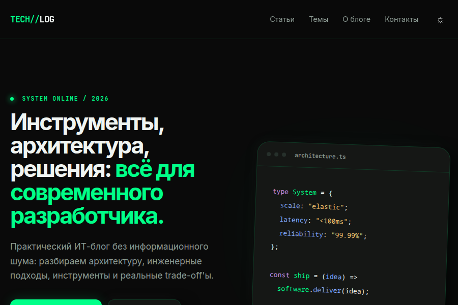

# Laravel Orchid Blog

Блог на базе **Laravel** с административной панелью **[Orchid](https://orchid.software/)**.



---

## ✨ Возможности «из коробки»

Всё перечисленное уже работает — ничего не нужно дописывать, чтобы получить рабочий блог.

### Публичная часть (Blade + Vite)

- **Лента статей** — главная страница с пагинацией, полнотекстовым поиском по заголовку/контенту, выводом рубрик и меток.
- **Страница статьи** — Markdown-контент (конвертируется в HTML на сервере), автоматически собранное **оглавление** по заголовкам `<h2>/<h3>`, теги, рубрика, дата публикации.
- **Рубрики и метки** — отдельные страницы `/rubric/{slug}` и `/tag/{slug}` с фильтрацией статей.
- **Поиск** — по всем опубликованным статьям (`?search=`).
- **Черновики** — отдельная страница `/notpublic` для администратора: статьи с `is_published = false` и будущей датой выхода.
- **Страницы** — «О блоге», «Политика конфиденциальности», «Обратная связь», кастомные страницы ошибок (`403`, `404`, `500` и др.).
- **Тёмная/светлая тема** — переключатель в шапке, выбор сохраняется в `localStorage`.
- **SEO-разметка** — `title`/`description`, Open Graph и Twitter Card для каждой статьи.
- **Двуязычность** — русский/английский, переключение через `GET /setlocale/{locale}` (сессия + middleware `Localize`).

### Комментарии

- **Гостевые комментарии** — без регистрации: имя, email, **математическая капча** (ответ хранится в сессии).
- **Комментарии авторизованных** — капча не требуется, публикуются сразу.
- **Модерация** — гостевые комментарии уходят на подтверждение администратора (`active = false`), одобрение/удаление в админке.
- **Защита от спама** — `throttle:10,1` на отправку, сохраняется IP гостя.

### Рассылка и уведомления

- **Подписка на новые статьи** — форма в модальном окне и в футере, адрес хранится в `subscribers`.
- **Отписка по одноразовому токену** — ссылка `unsubscribe/{token}` в каждом письме.
- **Письма через очередь** — `NewArticleMail` (`ShouldQueue`), обработчик в контейнере `queue`, в dev — MailHog.
- **Автопубликация запланированных статей** — команда `articles:publish-scheduled` (контейнер `schedule`, каждую минуту) публикует статьи с наступившей датой и тут же рассылает письмо подписчикам.

### Обратная связь

- Форма `/contact` с валидацией (`ContactRequest`), заявки сохраняются в `contacts` и видны в админке; гостем — по имени и email.

### Админ-панель Orchid (`/admin`)

- **CRUD статей** — список с пагинацией, модальные окна создания/редактирования, Markdown-редактор, автогенерация уникального `slug`, черновик/публикация, планирование даты, ключевые слова и мета-описание.
- **CRUD рубрик и меток** — счётчик статей у меток пересчитывается автоматически (`ArticleObserver`).
- **Роли и права** — стандартные экраны «Пользователи» и «Роли» плюс собственные права `platform.custom.articles`, `platform.custom.rubrics`, `platform.custom.comments` (меню и разделы скрываются без соответствующего права).
- **Модерация комментариев** — список, карточка комментария, одобрение и удаление.
- **Сообщения обратной связи** — список и карточка сообщения.
- **Подписчики** — список активных подписчиков, удаление.
- **Профиль администратора** — смена пароля и данных.

### Инфраструктура

- **Docker Compose** — nginx, PHP-FPM 8.5, Node.js, MySQL 8, phpMyAdmin, MailHog, а также воркеры `schedule` и `queue`; всё поднимается через `make`.
- **Тесты** — PHPUnit: feature-тесты публичных страниц, комментариев, контактов, подписки, профиля и unit-тесты моделей/сервисов (`make test`).

> **Чего пока нет (легко добавить самостоятельно):** загрузка изображений к статьям.
> В Orchid уже есть готовые поля `Upload`/`Picture`, а в таблице `articles` — колонка `image`,
> но в форме статьи поле не подключено, а в шаблоне статьи стоит заглушка-градиент
> (`resources/views/article.blade.php`). Чтобы включить: добавьте `Picture::make('article.image')`
> в `app/Orchid/Layouts/CreateOrUpdateArticle.php` и выведите значение в шаблоне.
> Свои favicon и логотип также нужно заменить — см. раздел «Что нужно поменять».

---

## 📋 Используемые технологии

### Backend
- **PHP** ^8.5
- **Laravel Framework** ^13.0
- **Orchid Platform** ^14.53 — административная панель
- **Laravel Sanctum** ^4.0 — аутентификация и API токены
- **Laravel Tinker** ^3.0 — интерактивная работа с приложением
- **mews/captcha** ^3.3 — капча (в связке с Google reCAPTCHA через middleware `GoogleRecaptcha`)
- **Guzzle HTTP** ^7.9 — HTTP-клиент

### Frontend (Blade-шаблоны Breeze/auth)
- **Vite** ^6.0 + **laravel-vite-plugin** — сборка ассетов Breeze
- **Tailwind CSS** ^3.4 + **@tailwindcss/forms**
- **Alpine.js** ^3.14
- **Sass** + **PostCSS** + **Autoprefixer**

### База данных и инфраструктура
- **MySQL** 8.0
- **Docker / Docker Compose** (nginx, PHP-FPM 8.5, Node.js, MySQL, phpMyAdmin, MailHog)

### Инструменты разработки
- **Laravel Breeze** — каркас аутентификации
- **Laravel IDE Helper**, **Faker**

---

## 🚀 Установка и запуск (только Docker)

> **Важно:** приложение запускается **только через Docker Compose**. Локальные
> PHP/Composer/npm/MySQL на хосте не используются — все команды выполняются
> внутри контейнеров через `Makefile`.

### Требования
- **Docker Engine** 24+ и **Docker Compose** (плагин `docker compose`)
- **Make** (для быстрой установки; без него — см. «Ручной запуск» ниже)

### 1. Клонирование репозитория

```bash
git clone git@github.com:alexchasx/laravel-orchid-blog.git
cd laravel-orchid-blog
```

### 2. Установка

```bash
make install
```

Команда выполняет полную настройку: собирает образы, копирует `.env.example` → `.env`,
запускает контейнеры и вызывает `make setup`. Сама установка (в уже запущенном Docker):

```bash
make setup
```

`make setup` устанавливает PHP-зависимости (`composer install`), генерирует `APP_KEY`,
запускает `migrate:fresh --seed`, создаёт администратора Orchid, делает `storage:link`,
ставит JS-зависимости (`npm install`) и собирает фронтенд. Команду удобно перезапускать
повторно, если контейнеры уже подняты и нужно полностью настроить проект заново.

Доступ после установки:
- Сайт: [http://localhost:8080](http://localhost:8080)
- Админ-панель Orchid: [http://localhost:8080/admin](http://localhost:8080/admin) — пользователь `admin@localhost.ru` / `123456`
- phpMyAdmin: [http://localhost:8899](http://localhost:8899)
- MailHog: [http://localhost:8026](http://localhost:8026)

> ⚠️ `make setup` (и `make install`) включает шаг **`migrate:fresh --seed`** — команда
> **разрушает** базу данных при повторном запуске.

### 3. Повседневные команды

```bash
make up     # собрать образы и поднять контейнеры
make down   # остановить контейнеры
make logs   # следить за логами
make shell  # войти в контейнер app (bash)
```

Приложение и его сервисы описаны в `docker/docker-compose.yml`:

| Сервис      | Контейнер        | Порт хост → контейнер |
|-------------|------------------|------------------------|
| nginx       | `blog_nginx`     | 8080 → 80              |
| PHP-FPM     | `blog_app`       | —                      |
| Node.js     | `blog_node`      | 5173 → 5173 (Vite dev) |
| MySQL 8.0   | `blog_db`        | 8101 → 3306            |
| phpMyAdmin  | `blog_phpmyadmin`| 8899 → 80              |
| MailHog     | `blog_mailhog`   | 8026 → 8025            |

Полный список команд Makefile — `make help`.

### Ручной запуск (без `make`)

```bash
cp .env.example .env

docker compose -f docker/docker-compose.yml up -d --build

docker compose -f docker/docker-compose.yml exec app composer install
docker compose -f docker/docker-compose.yml exec app php artisan key:generate
docker compose -f docker/docker-compose.yml exec app php artisan migrate:fresh --seed
docker compose -f docker/docker-compose.yml exec app php artisan orchid:admin admin admin@localhost.ru 123456
docker compose -f docker/docker-compose.yml exec app php artisan storage:link

docker compose -f docker/docker-compose.yml exec node npm install
docker compose -f docker/docker-compose.yml exec node npm run build
```

---

## 🔧 Что поменять после создания

Шаблон отдаётся с нейтральными настройками и демо-контентом. Перед публикацией
замените их на свои — список от обязательного до «по желанию».

### Обязательно

| Что | Где | Зачем |
|---|---|---|
| `APP_NAME` | `.env` | Имя сайта: `<title>` и OG-теги, футер, префиксы кэша/сессий/Redis (`config/app.php`, `layouts/techlog.blade.php`) |
| `APP_URL` | `.env` | Адрес сайта: генерация URL, ссылки в письмах (рассылка, отписка), URL загрузок (`config/app.php`, `config/filesystems.php`) |
| Пароль админа | Orchid | `make setup` создаёт `admin@localhost.ru` / `123456` — **смените пароль сразу** |
| Пароль тестового автора | `database/seeders/DatabaseSeeder.php` | Сид создаёт пользователя `author@example.test` / `password` — удалите или пересоздайте |

> После смены `APP_NAME` выполните `make clear`: префиксы кэша, сессий и Redis
> считаются через `Str::slug(env('APP_NAME'))`, старые ключи останутся в мусоре.

### Названия и тексты проекта

| Что | Где | Зачем |
|---|---|---|
| `composer.json` → `name` | корневой файл | Имя пакета (по умолчанию `laravel/laravel`) |
| `composer.json` → `description`, `keywords` | корневой файл | Описание пакета (по умолчанию «The Laravel Framework.», ключи Laravel) |
| `package.json` → `name` | корневой файл | Имя npm-пакета (в шаблоне — `laravel-blog-template`; пакет помечен `private`, менять необязательно) |
| Название в шапке | `resources/views/layouts/techlog.blade.php:44` | Логотип-текст `TECH//LOG` задан вручную, а не через `APP_NAME` |
| `robots.txt` | `public/robots.txt` | Сейчас открыт для всех (`Disallow:`) — при необходимости закройте админку |

### Логотип и favicon

| Что | Где | Зачем |
|---|---|---|
| `favicon.ico` | `public/favicon.ico` | Заглушка Laravel. Подключается в `techlog` (`layouts/techlog.blade.php`) и в legacy-шаблоне `layouts/base.blade.php` — замените файл в `public/` на свой |
| Логотип / OG-изображение | `public/` | Не поставляются: OG-картинка статей не загружается, в `article.blade.php` стоит заглушка-градиент |

Ассеты Orchid (`public/vendor/orchid/`) — это опубликованная копия ассетов пакета,
она нужна для работы админки. После обновления `orchid/platform` переопубликуйте их:
`php artisan orchid:publish`.

### Настройки Orchid (`config/platform.php`)

| Параметр | Env-переменная | По умолчанию | Зачем менять |
|---|---|---|---|
| `prefix` | `PLATFORM_PREFIX` | `/admin` | Адрес админки (например `/panel`) |
| `domain` | `PLATFORM_DOMAIN` | — | Домен, если админка на отдельном поддомене |
| `middleware` | — | стандартный стек | Дополнительные middleware админки |
| `template.header` / `template.footer` | — | `''` | Свои header/footer-шаблоны Orchid |
| `notifications.enabled` | — | `true` | Отключить периодические уведомления Orchid |
| `search` | — | `[]` | Добавить модели (`\App\Models\User::class`) в поиск по сайдбару |
| `attachment.disk` | `PLATFORM_FILESYSTEM_DISK` | `public` | Диск для вложений Orchid |

> Права, меню и экраны админки заданы в `app/Orchid/PlatformProvider.php`
> (пункты меню, пермишены `platform.custom.*`).

### Контакты и подписи (`config/my_config.php`)

Все значения читаются из `.env` — править PHP-конфиг не нужно:

| Переменная | Где используется |
|---|---|
| `SLOGAN` | футер `layouts/techlog.blade.php` |
| `SUB_LOGO` | подзаголовок сайта (legacy-шаблон `layouts/base.blade.php`) |
| `MY_GITHUB`, `MY_TELEGRAM` | ссылки в футере (показываются, только если значение не пустое) |
| `CONTACT_EMAIL` | страница «Контакты» (`contact.blade.php`); ссылка показывается, только если значение не пустое |
| `MAIL_FROM_ADDRESS` | отправитель писем рассылки |

### Демо-контент

`database/seeders/DatabaseSeeder.php` наполняет базу стартовым содержимым:
6 рубрик, 21 метку, 25 статей (все опубликованы) и тестового автора
`author@example.test`. Свои данные удобно добавить
в этот же сидер; чтобы начать с чистой базы — отключите вызов сидера и выполните
`docker compose -f docker/docker-compose.yml exec app php artisan migrate:fresh`
(⚠️ команда **удаляет** все данные).

### Перед деплоем

- [ ] `docker/docker-compose.yml` — замените `phpMyAdmin`/`MailHog`/Vite-dev-сервисы на то, что нужно на сервере; собственный `nginx` конфиг — в `docker/nginx/`.
- [ ] `MAIL_*` в `.env` — реальный SMTP вместо `mailhog`; `QUEUE_CONNECTION=database` требует запущенного `php artisan queue:work` (контейнер `blog_queue`).
- [ ] `php artisan schedule:work` (контейнер `blog_schedule`) — без него запланированные статьи не публикуются.
- [ ] `APP_DEBUG=false` и корректный `APP_ENV=production` на сервере.
- [ ] Права `www-data` на `storage/` и `bootstrap/cache` (`make storage-perm`).
- [ ] Сборка фронтенда: `make frontend-build` (Vite, 5 входных точек в `vite.config.js`).

---

## 📂 Структура проекта

### Приложение `app/`
- `app/Models/` — доменные модели (`Article`, `Rubric`, `Tag`, `Comment`, `Contact`, `Subscriber`, `User`)
- `app/Http/Controllers/` — контроллеры публичной части и авторизации (Breeze)
- `app/Http/Requests/` — FormRequest-валидация (статьи, комментарии, подписка, контакты)
- `app/Http/Middleware/` — кастомные middleware (`Localize`, `GoogleRecaptcha`, `TrustProxies`)
- `app/Orchid/` — админ-панель Orchid: экраны (`Screens/`), layout'ы (`Layouts/`), фильтры, `PlatformProvider`
- `app/Services/` — сервисный слой (`ArticleService`, `CacheService`)
- `app/Observers/` — модель "отслеживания" (`ArticleObserver`, `RubricObserver`, `TagObserver`): обновление счётчиков, рассылка
- `app/Console/Commands/` — консольные команды (автопубликация статей по расписанию)
- `app/Mail/` — Mailable-классы (`NewArticleMail` — рассылка подписчикам)
- `app/Support/` и `app/Rules/` — капча и правила валидации (`MathCaptcha`, `MathCaptchaRule`)
- `app/Providers/` — сервис-провайдеры

### Настройки и данные
- `config/` — конфигурация, в т.ч. `my_config.php` (соцсети, контакты, слоган)
- `database/migrations/`, `database/seeders/`, `database/factories/` — миграции, сиды и фабрики
- `lang/` — языковые файлы (ru, en)

### HTTP и маршруты
- `routes/` — маршруты приложения (`web.php`, `platform.php`, `auth.php`, `console.php`)
- `bootstrap/app.php` — регистрация маршрутов и middleware (Laravel 13-стиль)

### Фронтенд
- `resources/views/` — Blade-шаблоны (публичная часть, layout `techlog`, auth, компоненты, emails)
- `resources/sass/` — стили (новый дизайн `techlog/` + legacy `style.scss`)
- `resources/js/` — скрипты (`techlog.js` — новый фронтенд, `app.js` — legacy/Alpine)
- `resources/css/` — CSS-ассеты
- `public/` — публично доступные файлы (собранные ассеты, изображения)
- `vite.config.js` — сборка фронтенда

### Инфраструктура и остальное
- `docker/` — конфигурация Docker (nginx, PHP-FPM, Node, MySQL, phpMyAdmin, MailHog)
- `tests/` — PHPUnit-тесты
- `docs/` — документация проекта (архитектура, планы миграции)
- `Makefile` — основной dev-workflow