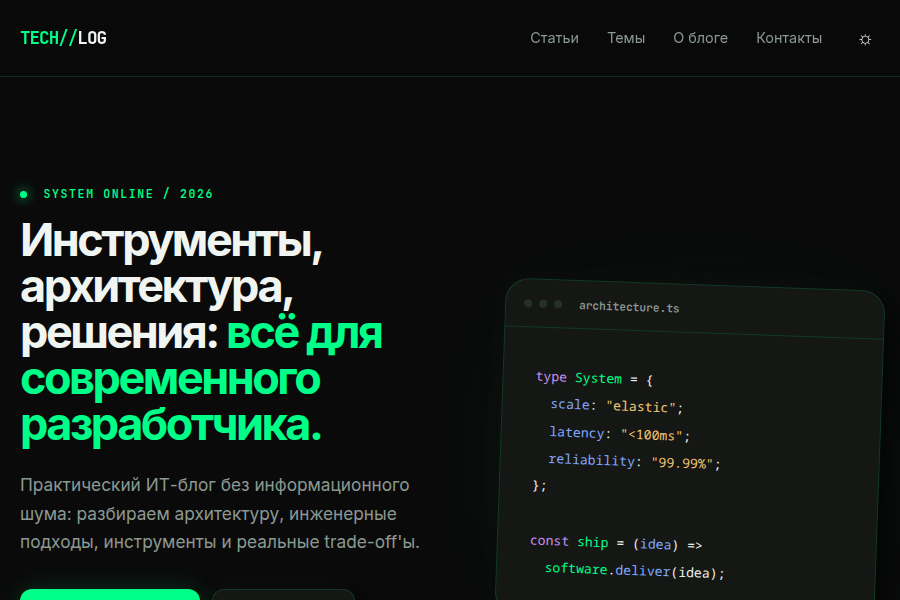

# Laravel Orchid Blog

Блог на базе **Laravel** с административной панелью **[Orchid](https://orchid.software/)**.



---

## ✨ Возможности «из коробки»

Всё перечисленное уже работает — ничего не нужно дописывать, чтобы получить рабочий блог.

### Публичная часть (Blade + Vite)

- **Лента статей** — главная страница с пагинацией, полнотекстовым поиском по заголовку/контенту, выводом рубрик и меток.
- **Страница статьи** — Markdown-контент (конвертируется в HTML на сервере), автоматически собранное **оглавление** по заголовкам `<h2>/<h3>`, теги, рубрика, дата публикации, блок **«Похожие статьи»** (до 3 карточек, совпадение по тегам → добор по рубрике).
- **Рубрики и метки** — отдельные страницы `/rubric/{slug}` и `/tag/{slug}` с фильтрацией статей.
- **Поиск** — по всем опубликованным статьям (`?search=`).
- **Черновики** — отдельная страница `/notpublic` для администратора: статьи с `is_published = false` и будущей датой выхода.
- **Страницы** — «О блоге», «Политика конфиденциальности», «Обратная связь», кастомные страницы ошибок (`403`, `404`, `500` и др.).
- **Тёмная/светлая тема** — переключатель в шапке, выбор сохраняется в `localStorage`.
- **SEO-разметка** — `title`/`description`, Open Graph и Twitter Card для каждой статьи и страницы.
- **Canonical URL** — на каждой публичной странице; для пагинации 1-я страница без `?page=N`, страницы 2+ — self-canonical.
- **noindex** — для поиска (`?search=`), пагинации `page>=2`, `/notpublic`, `/dashboard`, `/profile`, `/unsubscribe`, `/consent/revoke` и тестовых страниц — роботы не индексируют.
- **JSON-LD** — структурированные данные Schema.org: Article, BreadcrumbList, WebSite+SearchAction, Organization (только на индексируемых страницах).
- **sitemap.xml** — генерация через `SitemapController` с кэшированием (1 час); включает главную, статьи, рубрики, теги, статические страницы.
- **robots.txt** — блокирует `/nexus`, `/dashboard`, `/profile`, `/login`, `/register`, `/test-*`, `/notpublic`, `/unsubscribe`, `/consent/revoke`, `?search=`, `?page=`; содержит ссылку на sitemap.
- **RSS 2.0-лента** — `GET /rss` (контроллер `FeedController`), кэш 1 час, последние 20 опубликованных статей; `<link rel="alternate" type="application/rss+xml">` в `<head>`.
- **Абсолютные URL** в OG/Twitter/JSON-LD/sitemap — все пути к изображениям приводятся к абсолютным (`{APP_URL}/storage/...`) через `App\Support\Seo::absoluteUrl()`.
- **Slug-URL рубрик и тегов** — `/rubric/{slug}` и `/tag/{slug}`; старые `/rubric/{id}` и `/tag/{id}` возвращают 301 на новый URL.
- **H1-иерархия** — ровно один `<h1>` на страницу: на главной — hero-заголовок, на рубрике/теге — название рубрики/тега.
- **Хлебные крошки** — навигационная цепочка Главная → Рубрика → Статья (или Метка) с JSON-LD BreadcrumbList.
- **gzip** — сжатие nginx для HTML, CSS, JS, JSON, XML, SVG (уровень 6).
- **Favicon** — `favicon.ico`, `apple-touch-icon.png` (180×180) и `site.webmanifest` для iOS-закладок и PWA-совместимости.
- **Страницы согласий** `/consent/processing` и `/consent/distribution` — индексируются роботами (полезные юридические страницы), не включаются в sitemap (низкая ценность для навигации), не блокируются в robots.txt.
- **Двуязычность** — русский/английский, переключение через `GET /setlocale/{locale}` (сессия + middleware `Localize`).

### Комментарии

- **Гостевые комментарии** — без регистрации: имя, email, **математическая капча** (ответ хранится в сессии).
- **Комментарии авторизованных** — капча не требуется, публикуются сразу.
- **Модерация** — гостевые комментарии уходят на подтверждение администратора (`active = false`), одобрение/удаление в админке.
- **Защита от спама** — `throttle:10,1` на отправку, сохраняется IP гостя.
- **Согласия на обработку ПДн (152-ФЗ)** — обязательные чекбоксы «на обработку» и «на распространение» персональных данных; каждый факт согласия фиксируется в таблице `consent_logs` (IP, User-Agent, URL страницы, дословный текст, версия). Публичные страницы `/consent/processing` и `/consent/distribution` содержат полные тексты согласий с реквизитами оператора из `config/operator.php`. Механизм отзыва: на распространение → обезличивание комментария (имя → «Аноним») с прекращением распространения в течение 3 рабочих дней (ч. 4 ст. 9 № 152-ФЗ); на обработку → полное удаление комментария; удаление/обезличивание — в течение 7 рабочих дней. Отзыв обрабатывается синхронно, а просроченные отзывы догоняет команда `consents:process-revocations` (раз в сутки). Журнал `consent_logs` просматривается через БД/phpMyAdmin (экрана Orchid нет).

### Рассылка и уведомления

- **Подписка на новые статьи** — форма в модальном окне и в футере, адрес хранится в `subscribers`.
- **Отписка по одноразовому токену** — ссылка `unsubscribe/{token}` в каждом письме.
- **Письма через очередь** — `NewArticleMail` (`ShouldQueue`), обработчик в контейнере `queue`, в dev — MailHog.
- **Автопубликация запланированных статей** — команда `articles:publish-scheduled` (контейнер `schedule`, каждую минуту) публикует статьи с наступившей датой и тут же рассылает письмо подписчикам.

### Обратная связь

- Форма `/contact` с валидацией (`ContactRequest`), заявки сохраняются в `contacts` и видны в админке; гостем — по имени и email.

### Админ-панель Orchid (`/nexus`)

- **CRUD статей** — список с пагинацией, модальные окна создания/редактирования, Markdown-редактор, автогенерация уникального `slug`, черновик/публикация, планирование даты, ключевые слова и мета-описание.
- **CRUD рубрик и меток** — счётчик статей у меток пересчитывается автоматически (`ArticleObserver`).
- **Роли и права** — стандартные экраны «Пользователи» и «Роли» плюс собственные права `platform.custom.articles`, `platform.custom.rubrics`, `platform.custom.comments` (меню и разделы скрываются без соответствующего права).
- **Модерация комментариев** — список, карточка комментария, одобрение и удаление.
- **Сообщения обратной связи** — список и карточка сообщения.
- **Подписчики** — список активных подписчиков, удаление.
- **Профиль администратора** — смена пароля и данных.

### Инфраструктура

- **Docker Compose** — nginx, PHP-FPM 8.5, Node.js, MySQL 8, phpMyAdmin, MailHog, а также воркеры `schedule` и `queue`; всё поднимается через `make`.
- **Тесты** — PHPUnit: feature-тесты публичных страниц, комментариев, контактов, подписки, профиля и unit-тесты моделей/сервисов (`make test`).

> **Чего пока нет (легко добавить самостоятельно):**
> Свои favicon, apple-touch-icon и логотип также нужно заменить — см. раздел «Что нужно поменять».
>
> **Настройка оператора ПДн:** заполните переменные `OPERATOR_NAME`, `OPERATOR_ADDRESS`,
> `OPERATOR_INN`, `OPERATOR_OGRN`, `OPERATOR_EMAIL`, `OPERATOR_PHONE` в `.env` —
> они используются в текстах согласий на обработку и распространение персональных данных.

---

## 📋 Используемые технологии

### Backend
- **PHP** ^8.5
- **Laravel Framework** ^13.0
- **Orchid Platform** ^14.53 — административная панель
- **Laravel Sanctum** ^4.0 — аутентификация и API токены
- **Laravel Tinker** ^3.0 — интерактивная работа с приложением
- **Guzzle HTTP** ^7.9 — HTTP-клиент

### Frontend (Blade-шаблоны Breeze/auth)
- **Vite** ^6.0 + **laravel-vite-plugin** — сборка ассетов Breeze
- **Tailwind CSS** ^3.4 + **@tailwindcss/forms**
- **Alpine.js** ^3.14
- **Sass** + **PostCSS** + **Autoprefixer**

### База данных и инфраструктура
- **MySQL** 8.0
- **Docker / Docker Compose** (nginx, PHP-FPM 8.5, Node.js, MySQL, phpMyAdmin, MailHog)

### Инструменты разработки
- **Laravel Breeze** — каркас аутентификации
- **Laravel IDE Helper**, **Faker**

---

## 🚀 Установка и запуск (только Docker)

> **Важно:** приложение запускается **только через Docker Compose**. Локальные
> PHP/Composer/npm/MySQL на хосте не используются — все команды выполняются
> внутри контейнеров через `Makefile`.

### Требования
- **Docker Engine** 24+ и **Docker Compose** (плагин `docker compose`)
- **Make** (для быстрой установки; без него — см. «Ручной запуск» ниже)

### 1. Клонирование репозитория

```bash
git clone git@github.com:alexchasx/laravel-orchid-blog.git
cd laravel-orchid-blog
```

### 2. Установка

```bash
make install
```

Команда выполняет полную настройку: собирает образы, копирует `.env.example` → `.env`,
запускает контейнеры и вызывает `make setup`. Сама установка (в уже запущенном Docker):

```bash
make setup
```

`make setup` устанавливает PHP-зависимости (`composer install`), генерирует `APP_KEY`,
запускает `migrate:fresh --seed`, создаёт администратора Orchid, делает `storage:link`,
ставит JS-зависимости (`npm install`) и собирает фронтенд. Команду удобно перезапускать
повторно, если контейнеры уже подняты и нужно полностью настроить проект заново.

Доступ после установки:
- Сайт: [http://localhost:8080](http://localhost:8080)
- Админ-панель Orchid: [http://localhost:8080/nexus](http://localhost:8080/nexus) — пользователь `admin@localhost.ru` / `123456`
- phpMyAdmin: [http://localhost:8899](http://localhost:8899)
- MailHog: [http://localhost:8026](http://localhost:8026)

> ⚠️ `make setup` (и `make install`) включает шаг **`migrate:fresh --seed`** — команда
> **разрушает** базу данных при повторном запуске.

### 3. Повседневные команды

```bash
make up     # собрать образы и поднять контейнеры
make down   # остановить контейнеры
make logs   # следить за логами
make shell  # войти в контейнер app (bash)
```

Приложение и его сервисы описаны в `docker/docker-compose.yml`:

| Сервис      | Контейнер        | Порт хост → контейнер |
|-------------|------------------|------------------------|
| nginx       | `blog_nginx`     | 8080 → 80              |
| PHP-FPM     | `blog_app`       | —                      |
| Node.js     | `blog_node`      | 5173 → 5173 (Vite dev) |
| MySQL 8.0   | `blog_db`        | 8101 → 3306            |
| phpMyAdmin  | `blog_phpmyadmin`| 8899 → 80              |
| MailHog     | `blog_mailhog`   | 8026 → 8025            |

> **Продакшн-образы — отдельные теги.** Прод-стек описан в
> `docker/docker-compose.prod.yml` и собирает образы `blog_app_prod`
> (app/schedule/queue) и `blog_nginx_prod` (nginx), чтобы не переиспользовать
> и не перезаписывать dev-образы `blog_app`/`blog_nginx`.

Полный список команд Makefile — `make help`.

### Ручной запуск (без `make`)

```bash
cp .env.example .env

docker compose -f docker/docker-compose.yml up -d --build

docker compose -f docker/docker-compose.yml exec app composer install
docker compose -f docker/docker-compose.yml exec app php artisan key:generate
docker compose -f docker/docker-compose.yml exec app php artisan migrate:fresh --seed
docker compose -f docker/docker-compose.yml exec app php artisan orchid:admin admin admin@localhost.ru 123456
docker compose -f docker/docker-compose.yml exec app php artisan storage:link

docker compose -f docker/docker-compose.yml exec node npm install
docker compose -f docker/docker-compose.yml exec node npm run build
```

---

## 🔧 Что поменять после создания

Шаблон отдаётся с нейтральными настройками и демо-контентом. Перед публикацией
замените их на свои — список от обязательного до «по желанию».

### Обязательно

| Что | Где | Зачем |
|---|---|---|
| `APP_NAME` | `.env` | Имя сайта: `<title>` и OG-теги, футер, префиксы кэша/сессий/Redis (`config/app.php`, `layouts/techlog.blade.php`) |
| `APP_URL` | `.env` | Адрес сайта: генерация URL, ссылки в письмах (рассылка, отписка), URL загрузок (`config/app.php`, `config/filesystems.php`) |
| Пароль админа | Orchid | `make setup` создаёт `admin@localhost.ru` / `123456` — **смените пароль сразу** |
| Пароль тестового автора | `database/seeders/DatabaseSeeder.php` | Сид создаёт пользователя `author@example.test` / `password` — удалите или пересоздайте |

> После смены `APP_NAME` выполните `make clear`: префиксы кэша, сессий и Redis
> считаются через `Str::slug(env('APP_NAME'))`, старые ключи останутся в мусоре.

### Названия и тексты проекта

| Что | Где | Зачем |
|---|---|---|
| `composer.json` → `name` | корневой файл | Имя пакета (по умолчанию `laravel/laravel`) |
| `composer.json` → `description`, `keywords` | корневой файл | Описание пакета (по умолчанию «The Laravel Framework.», ключи Laravel) |
| `package.json` → `name` | корневой файл | Имя npm-пакета (в шаблоне — `laravel-blog-template`; пакет помечен `private`, менять необязательно) |
| Название в шапке | `resources/views/layouts/techlog.blade.php:44`  задан вручную, а не через `APP_NAME` |
| `robots.txt` | `GET /robots.txt` → `RobotsController` | Динамический: блокирует служебные пути и содержит `Sitemap: {APP_URL}/sitemap.xml` |

### Логотип и favicon

| Что | Где | Зачем |
|---|---|---|
| `favicon.ico` | `public/favicon.ico` | Заглушка Laravel. Подключается в `techlog` — замените на свой |
| `apple-touch-icon.png` | `public/apple-touch-icon.png` | Иконка для iOS-закладок (180×180), заглушка-акцент |
| `site.webmanifest` | `public/site.webmanifest` | PWA-манифест (name, icons, theme_color), опционально |
| Логотип / OG-изображение | `public/` | Не поставляются: OG-картинка генерируется из загруженного изображения статьи |

Ассеты Orchid (`public/vendor/orchid/`) — это опубликованная копия ассетов пакета,
она нужна для работы админки. После обновления `orchid/platform` переопубликуйте их:
`php artisan orchid:publish`.

### Настройки Orchid (`config/platform.php`)

| Параметр | Env-переменная | По умолчанию | Зачем менять |
|---|---|---|---|
| `prefix` | `PLATFORM_PREFIX` | `/nexus` | Адрес админки (например `/panel`) |
| `domain` | `PLATFORM_DOMAIN` | — | Домен, если админка на отдельном поддомене |
| `middleware` | — | стандартный стек | Дополнительные middleware админки |
| `template.header` / `template.footer` | — | `''` | Свои header/footer-шаблоны Orchid |
| `notifications.enabled` | — | `true` | Отключить периодические уведомления Orchid |
| `search` | — | `[]` | Добавить модели (`\App\Models\User::class`) в поиск по сайдбару |
| `attachment.disk` | `PLATFORM_FILESYSTEM_DISK` | `public` | Диск для вложений Orchid |

> Права, меню и экраны админки заданы в `app/Orchid/PlatformProvider.php`
> (пункты меню, пермишены `platform.custom.*`).

### Контакты и подписи (`config/my_config.php`)

Все значения читаются из `.env` — править PHP-конфиг не нужно:

| Переменная | Где используется |
|---|---|
| `SLOGAN` | футер `layouts/techlog.blade.php` |
| `MY_GITHUB`, `MY_TELEGRAM` | ссылки в футере (показываются, только если значение не пустое) |
| `CONTACT_EMAIL` | страница «Контакты» (`contact.blade.php`); ссылка показывается, только если значение не пустое |
| `MAIL_FROM_ADDRESS` | отправитель писем рассылки |

### Демо-контент

`database/seeders/DatabaseSeeder.php` наполняет базу стартовым содержимым:
6 рубрик, 21 метку, 25 статей (все опубликованы) и тестового автора
`author@example.test`. Свои данные удобно добавить
в этот же сидер; чтобы начать с чистой базы — отключите вызов сидера и выполните
`docker compose -f docker/docker-compose.yml exec app php artisan migrate:fresh`
(⚠️ команда **удаляет** все данные).

### Перед деплоем

> Полный порядок действий — в разделе «Деплой на продакшн» ниже; этот чек-лист — краткая выжимка для локальной подготовки.

- [ ] `docker/docker-compose.yml` — замените `phpMyAdmin`/`MailHog`/Vite-dev-сервисы на то, что нужно на сервере; собственный `nginx` конфиг — в `docker/nginx/`.
- [ ] `MAIL_*` в `.env` — реальный SMTP вместо `mailhog`; `QUEUE_CONNECTION=database` требует запущенного `php artisan queue:work` (контейнер `blog_queue`).
- [ ] `php artisan schedule:work` (контейнер `blog_schedule`) — без него запланированные статьи не публикуются.
- [ ] `APP_DEBUG=false` и корректный `APP_ENV=production` на сервере.
- [ ] Права `www-data` на `storage/` и `bootstrap/cache` (`make storage-perm`).
- [ ] Сборка фронтенда: `make frontend-build` (Vite, 5 входных точек в `vite.config.js`).

---

## 🚀 Деплой на продакшн (Ubuntu 24.04 VPS)

> Прод-стек — [`docker/docker-compose.prod.yml`](docker/docker-compose.prod.yml) (nginx + PHP-FPM 8.5 + MySQL 8.0 + воркеры `schedule`/`queue`);
> фронтенд собирается внутрь образа (multi-stage, [`Dockerfile.prod`](docker/app/Dockerfile.prod)), поэтому на сервере нужны только Docker и код репозитория.
> Детальный план с обоснованием каждого шага — [`plans/deployment-plan-vps-docker.md`](plans/deployment-plan-vps-docker.md).

### Шаг 1. Подготовка сервера

Скрипт [`provision-server.sh`](provision-server.sh) ставит на чистой Ubuntu 24.04 LTS всё необходимое перед первым деплоем:
базовые пакеты, часовой пояс `Europe/Moscow`, swap, пользователя для деплоя с SSH-ключом, ужесточённый sshd,
Docker Engine + Compose plugin, firewall ufw, опционально fail2ban и автообновления безопасности, каталог бэкапов.

Минимальные требования к VPS: **2 vCPU / 2–4 ГБ RAM / 30 ГБ SSD**.

```bash
# скопировать скрипт на сервер (scp/rsync/cat) и запустить от root:
sudo bash provision-server.sh \
  --user deploy \
  --ssh-key "ssh-ed25519 AAAA... your@host" \
  --with-fail2ban --with-unattended
```

Что делает скрипт (идемпотентно — повторный запуск безопасен, выполненные шаги пропускаются):

| № | Действие |
|---|---|
| 1 | `apt-get update && upgrade`, базовые пакеты (git, curl, rsync, jq, openssh-server…) |
| 2 | `timedatectl set-timezone Europe/Moscow` (совпадает с `config/app.php`) |
| 3 | swap-файл `/swapfile` (по умолчанию 2 ГБ, `vm.swappiness=10`) |
| 4 | пользователь `deploy` (группы `sudo` и `docker`), пароль заблокирован, вход только по ключу |
| 5 | sshd: `PermitRootLogin no`, `PasswordAuthentication no`, `AllowUsers deploy` (шаг пропускается, если не передан `--ssh-key` — иначе есть риск заблокировать самому себе вход) |
| 6 | Docker Engine + Compose plugin из официального репозитория Docker |
| 7 | ufw: разрешены только `SSH/22`, `80`, `443` (порт SSH определяется автоматически) |
| 8 | fail2ban — при `--with-fail2ban` |
| 9 | unattended-upgrades — при `--with-unattended` |
| 10 | каталог бэкапов `/var/backups/blog` (владелец — пользователь деплоя) |

Флаги: `--user NAME`, `--ssh-key "KEY"`, `--swap SIZE_GB`, `--with-fail2ban`, `--with-unattended`, `--skip-firewall`, `--help`.

### Шаг 2. Домен и DNS

- `A`-запись домена (и `www`, если используется) на IP сервера — дождаться пропагации.
- Для рассылки и формы обратной связи — почтовые записи `MX`, `SPF` (`TXT`), `DKIM`, `DMARC`, иначе письма попадают в спам.

### Шаг 3. TLS

**Вариант A — хостовый reverse proxy (рекомендуется).** nginx на хосте терминирует TLS и проксирует на контейнер:

1. Установить: `apt-get install nginx certbot python3-certbot-nginx`.
2. Освободить порт 80 для хостового nginx — в [`docker/docker-compose.prod.yml`](docker/docker-compose.prod.yml:36) заменить `ports: ["80:80"]` на `ports: ["127.0.0.1:8080:80"]`.
3. Конфиг `/etc/nginx/sites-available/blog` (затем `ln -s` в `sites-enabled` и `nginx -t && systemctl reload nginx`):

```nginx
server {
    listen 80;
    server_name example.com www.example.com;

    location / {
        proxy_pass http://127.0.0.1:8080;
        proxy_set_header Host              $host;
        proxy_set_header X-Real-IP         $remote_addr;
        proxy_set_header X-Forwarded-For   $proxy_add_x_forwarded_for;
        proxy_set_header X-Forwarded-Proto $scheme;
    }
}
```

4. Выпустить сертификат: `certbot --nginx -d example.com -d www.example.com` (автообновление через systemd-timer).
5. В [`docker/.env.prod`](docker/env.prod.example) оставить `TRUSTED_PROXIES=*` — Laravel через `TrustProxies` корректно определит схему `https` для canonical, OG/Twitter, sitemap и редиректов.

**Вариант B — TLS в контейнере nginx:** смонтировать сертификаты certbot в контейнер и добавить `listen 443 ssl` в [`docker/nginx/conf.d/nginx.conf`](docker/nginx/conf.d/nginx.conf:1).

**Вариант C — Cloudflare** (Flexible/Full): TLS на границе CDN; для режима Full укажите в `TRUSTED_PROXIES` диапазоны IP Cloudflare.

### Шаг 4. Первый деплой

```bash
# войти на сервер под пользователем деплоя
sudo mkdir -p /opt/blog
sudo chown "$USER":"$USER" /opt/blog
git clone git@github.com:alexchasx/laravel-orchid-blog.git /opt/blog
cd /opt/blog

make prod-env            # docker/env.prod.example → docker/.env.prod (права 600)
nano docker/.env.prod    # заполнить: APP_URL, DB_*, MAIL_*, OPERATOR_*, SEO_*, CONTACT_EMAIL...

# APP_KEY генерируется НА ХОСТЕ и вписывается в docker/.env.prod:
# (php artisan key:generate в контейнере писал бы в .env образа — он не персистентен)
KEY=$(openssl rand -base64 32)
sed -i "s|^APP_KEY=.*|APP_KEY=${KEY}|" docker/.env.prod

make prod-up             # собрать multi-stage образы и поднять стек (nginx, app, schedule, queue, db)
make prod-migrate        # php artisan migrate --force  (НЕ migrate:fresh!)
```

После первого `make prod-up` — разовые шаги:

```bash
make prod-shell   # войти в контейнер app и создать администратора Orchid:
#   php artisan orchid:admin admin admin@example.com СильныйПароль123!
#   exit
make prod-optimize    # config:cache + view:cache (route:cache запрещён — замыкания в routes/web.php)
curl -I http://localhost/up   # 200 OK (или https://домен/up)
```

> `storage:link` уже выполняется на этапе сборки образа ([`Dockerfile.prod`](docker/app/Dockerfile.prod:85)); `storage/` монтируется в named volume `app_storage` — загруженные изображения переживают пересборку.

### Шаг 5. Обновления (последующие деплои)

```bash
cd /opt/blog
./deploy.sh          # или make prod-deploy
```

[`deploy.sh`](deploy.sh:1) выполняет: бэкап БД (`mysqldump`) и `storage` (tar) с ротацией 14 дней → `git pull --ff-only` →
`docker compose up -d --build` → `migrate --force` → `config:cache` + `view:cache` → рестарт контейнеров → healthcheck `/up`.
Флаги: `--skip-backup`, `--skip-migrate`, `--no-pull`.

### Шаг 6. Очередь, планировщик и бэкапы

- Рассылка подписчикам (`queue`) и автопубликация статей (`schedule`) уже входят в прод-compose с `restart: unless-stopped` и `TZ=Europe/Moscow` — отдельной настройки не требуется.
- Ежедневный дамп БД через cron на хосте (ротация 14 дней) — готовый пример в [`plans/deployment-plan-vps-docker.md`](plans/deployment-plan-vps-docker.md), раздел 9.
- `storage/app/public` (загруженные изображения) и `docker/.env.prod` — в отдельное хранилище (rsync/borg), не на тот же диск.
- Мониторинг: health-эндпоинт `https://домен/up` (UptimeRobot и т. п.), логи — `docker compose -f docker/docker-compose.prod.yml --env-file docker/.env.prod logs -f` (`make prod-logs`).

### Шаг 7. Финальный smoke-тест

Чек-лист из 15 пунктов — [`plans/deployment-plan-vps-docker.md`](plans/deployment-plan-vps-docker.md), раздел 12: главная и лента, статья с оглавлением/изображением, рубрика/тег по slug и legacy-редирект 301, поиск и пагинация, `/sitemap.xml`/`/rss`/`/robots.txt`, гостевой комментарий (капча + оба согласия + `consent_logs`), форма обратной связи, подписка/отписка, автопубликация запланированной статьи, `/nexus`, HTTPS-редирект и абсолютные URL со схемой `https`.

---

## 📂 Структура проекта

### Приложение `app/`
- `app/Models/` — доменные модели (`Article`, `Rubric`, `Tag`, `Comment`, `Contact`, `Subscriber`, `User`)
- `app/Http/Controllers/` — контроллеры публичной части и авторизации (Breeze)
- `app/Http/Requests/` — FormRequest-валидация (статьи, комментарии, подписка, контакты)
- `app/Http/Middleware/` — кастомные middleware (`Localize`, `TrustProxies`)
- `app/Orchid/` — админ-панель Orchid: экраны (`Screens/`), layout'ы (`Layouts/`), фильтры, `PlatformProvider`
- `app/Services/` — сервисный слой (`ArticleService`, `CacheService`)
- `app/Observers/` — модель "отслеживания" (`ArticleObserver`, `RubricObserver`, `TagObserver`): обновление счётчиков, рассылка
- `app/Console/Commands/` — консольные команды (автопубликация статей по расписанию)
- `app/Mail/` — Mailable-классы (`NewArticleMail` — рассылка подписчикам)
- `app/Support/` и `app/Rules/` — капча и правила валидации (`MathCaptcha`, `MathCaptchaRule`)
- `app/Providers/` — сервис-провайдеры

### Настройки и данные
- `config/` — конфигурация, в т.ч. `my_config.php` (соцсети, контакты, слоган)
- `database/migrations/`, `database/seeders/`, `database/factories/` — миграции, сиды и фабрики
- `lang/` — языковые файлы (ru, en)

### HTTP и маршруты
- `routes/` — маршруты приложения (`web.php`, `platform.php`, `auth.php`, `console.php`)
- `bootstrap/app.php` — регистрация маршрутов и middleware (Laravel 13-стиль)

### Фронтенд
- `resources/views/` — Blade-шаблоны (публичная часть, layout `techlog`, auth, компоненты, emails)
- `resources/sass/` — стили (новый дизайн `techlog/` + legacy `style.scss`)
- `resources/js/` — скрипты (`techlog.js` — новый фронтенд, `app.js` — legacy/Alpine)
- `resources/css/` — CSS-ассеты
- `public/` — публично доступные файлы (собранные ассеты, изображения)
- `vite.config.js` — сборка фронтенда

### Инфраструктура и остальное
- `docker/` — конфигурация Docker (nginx, PHP-FPM, Node, MySQL, phpMyAdmin, MailHog)
- `tests/` — PHPUnit-тесты
- `docs/` — документация проекта (архитектура, планы миграции)
- `Makefile` — основной dev-workflow
