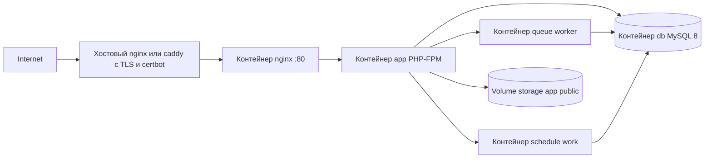

# План размещения проекта на VPS (Docker)

> Документ описывает, что нужно сделать перед и во время размещения блога
> (Laravel 13 + Orchid Platform 14) на VPS с Docker — по образцу локальной
> инфраструктуры `docker/docker-compose.yml`, но с продакшн-адаптацией.
>
> Стек: nginx + PHP-FPM 8.5 (app) + MySQL 8.0 (db) + воркер очереди (queue) +
> планировщик (schedule). Фронтенд собирается через Vite (public/build).

## 1. Целевая архитектура



Судьба сервисов текущего compose при переходе на прод:

| Сервис | Dev (`docker-compose.yml`) | Prod | Комментарий |
|---|---|---|---|
| `nginx` | да | **да** | порт 80; TLS — на хосте или в контейнере |
| `app` (PHP-FPM) | да | **да** | php:8.5.2-fpm-bookworm |
| `node` | да | **нет** | нужен только на этапе сборки фронтенда |
| `schedule` | да | **да** | `php artisan schedule:work` |
| `queue` | да | **да** | `php artisan queue:work --sleep=1 --tries=3` |
| `mailhog` | да | **нет** | заменить реальным SMTP-провайдером |
| `db` (MySQL 8.0) | да | **да** | named volume, без публикации порта наружу |
| `phpmyadmin` | да | **нет** | в проде не держать |

## 2. Подготовка репозитория (выполнить до деплоя)

### 2.1. Lock-файлы: осознанное решение
- `composer.lock` и `package-lock.json` сейчас не коммитятся (правило шаблона), а `minimum-stability: dev`.
- **Рекомендация для деплоя:** сгенерировать и закоммитить оба lock-файла — иначе на сервере `composer install`/`npm install` соберут другие версии зависимостей, чем локально (недетерминированные деплои).
- Альтернатива: продолжать ставить «свежие» версии, но тогда фиксировать версии основных пакетов в `composer.json` и тестировать на сервере после каждой установки.

### 2.2. Продакшн-шаблон окружения
- Добавить шаблон переменных для прода с плейсхолдерами:
  `APP_ENV=production`, `APP_DEBUG=false`, `APP_URL=https://домен`,
  `DB_*`, `MAIL_*`, `OPERATOR_*`, `HOSTING_PROVIDER`, `SEO_*`, `MY_GITHUB`,
  `CONTACT_EMAIL`, `SLOGAN`, `SUB_LOGO`, `PLATFORM_PREFIX=/nexus`.
- **Реализовано:** `docker/env.prod.example` → копируется в `docker/.env.prod`.
  Имя без ведущей точки — иначе правило `.env.*` в `.gitignore` не пропустит
  шаблон в git (исключение есть только для `.env.example`).

### 2.3. Продакшн-compose
- Создать `docker/docker-compose.prod.yml` (или отдельный каталог `deploy/`):
  - убрать `mailhog`, `phpmyadmin`, `node`;
  - `db`: named volume (`mysql_data`) вместо bind-каталога `./tmp/db`; **не публиковать порт** наружу (в dev это `8101`);
  - `db`: `MYSQL_DATABASE`/`MYSQL_USER`/`MYSQL_PASSWORD`/`MYSQL_ROOT_PASSWORD` через `env_file` (сильные пароли, отдельный пользователь приложения вместо root);
  - `nginx`: порты `80:80` (и `443:443`, если TLS в контейнере);
  - у всех сервисов `restart: unless-stopped` (уже есть) + healthcheck для `nginx` и `queue`;
  - ограничить ресурсы (`mem_limit`, `cpus`) и не поднимать `node` в проде.

### 2.4. Dockerfile и php.ini для прода
Текущий `docker/app/php.ini` содержит только `cgi.fix_pathinfo=0`,
`max_execution_time=1000`, `max_input_time=1000`, `memory_limit=4G` — это
**dev-значения**, для прода нужны другие:

```ini
; docker/app/php.ini (prod)
cgi.fix_pathinfo=0
max_execution_time=60
max_input_time=60
memory_limit=256M
upload_max_filesize=4M
post_max_size=8M
date.timezone=Europe/Moscow

; OPcache — обязателен в проде (в официальном образе PHP выключен)
opcache.enable=1
opcache.memory_consumption=128
opcache.max_accelerated_files=10000
opcache.validate_timestamps=1
opcache.revalidate_freq=60
```

В `docker/app/Dockerfile` дополнительно:
- проверить наличие расширения `pcntl` (`php -m | grep pcntl`); оно нужно
  `schedule:work` — при отсутствии добавить `docker-php-ext-install pcntl`;
- **рекомендуемая схема сборки — multi-stage**: один stage ставит
  `composer install --no-dev --optimize-autoloader` и `npm ci && npm run build`,
  финальный stage содержит код, vendor и `public/build`, а на рантайме монтируется
  только `storage/`. Это даёт воспроизводимые образы и не требует git/ssh/node в проде.
- Альтернатива (ближе к текущему dev-подходу): bind-mount репозитория на сервере,
  зависимости и ассеты ставятся при деплое командами из шага 6.

### 2.5. TrustedProxies — настроить под reverse proxy/CDN
Сейчас в [`app/Http/Middleware/TrustProxies.php`](../app/Http/Middleware/TrustProxies.php:15)
`protected $proxies;` равно `null` — **ни один прокси не доверяется**.
Если TLS терминируется хостовым nginx/caddy/Cloudflare, Laravel будет считать запрос
HTTP: сломаются абсолютные URL (`canonical`, OG, sitemap, редиректы), storage-ссылки.

Рекомендуемое изменение — сделать прокси управляемыми через env:

```php
protected $proxies = '*'; // или: protected $proxies = env('TRUSTED_PROXIES', '*');
```

(для схемы «reverse proxy на этом же хосте» подходит `'*'`; для Cloudflare —
лучше список их IP-диапазонов).

### 2.6. route:cache — запрещён (замыкания)
В [`routes/web.php`](../routes/web.php:26) есть замыкания: `test-*`, legacy-редиректы
`rubric/{id}`/`tag/{id}`, `consent/revoke` GET, `/dashboard`. `php artisan route:cache`
с ними падает. Решение:
- **вариант A (быстро):** в проде запускать только `config:cache` и `view:cache`,
  а запрет `route:cache` зафиксировать в документации и deploy-скрипте;
- **вариант B (оптимально, опционально):** вынести замыкания в контроллеры —
  тогда включается полный `route:cache` и заметно ускоряется маршрутизация.

### 2.7. Гигиена репозитория
- Убедиться, что `.env`, ключи, личные данные не попали в git (см. AGENTS.md).
- `APP_KEY` в `.env.example` пустой — генерируется на сервере.
- Проверить, что в `public/build` нет «мусорных» артефактов (ассеты собираются на сервере).

### 2.8. Тесты перед деплоем
- Локально: `make test` (Feature+Unit), `make lint`.
- Загрузить изображение статьи, проверить рассылку в MailHog (до переноса на SMTP).

## 3. Подготовка VPS

- [ ] 3.1. ОС: Ubuntu 24.04 LTS (рекомендовано). Минимально: 2 vCPU / 2–4 GB RAM / 30 GB SSD (проект лёгкий; запас нужен под Docker, БД и сборку фронтенда).
- [ ] 3.2. SSH: зайти по ключу, отключить `PasswordAuthentication yes`; создать непривилегированного пользователя с `sudo`.
- [ ] 3.3. Firewall: `ufw allow 22/tcp`, `80/tcp`, `443/tcp`, включить `ufw enable`.
- [ ] 3.4. Docker Engine + Docker Compose plugin (`docker compose version`); добавить пользователя в группу `docker`.
- [ ] 3.5. Swap 2 GB (для небольших тарифов); часовой пояс сервера — `Europe/Moscow` (для консистентности логов с `config/app.php`).
- [ ] 3.6. (Опционально) `fail2ban`, `unattended-upgrades`.

## 4. Домен и TLS

- [ ] 4.1. DNS: `A`-запись домена (и `www`, если используется) на IP VPS; дождаться пропагации.
- [ ] 4.2. Почтовые DNS (нужно для писем рассылки и формы обратной связи): `MX`, `SPF` (`TXT`), `DKIM`, `DMARC`.
- [ ] 4.3. TLS (выбрать один вариант):
  - **A. Хостовый reverse proxy** (рекомендуется): на хосте nginx или caddy, терминирует TLS (Let's Encrypt + автообновление), проксирует на контейнер `nginx:80`. Минимум изменений в compose.
  - **B. TLS в контейнере nginx**: монтируются сертификаты certbot (certbot на хосте или sidecar), в `nginx.conf` добавляется `listen 443 ssl`.
  - **C. Cloudflare** (Flexible/Full) — бесплатный TLS на границе.
- [ ] 4.4. Настроить `TRUSTED_PROXIES` в соответствии с выбранным вариантом (см. 2.5).

## 5. Переменные окружения (.env на сервере)

Ключевые значения для прода:

| Переменная | Значение |
|---|---|
| `APP_ENV` | `production` |
| `APP_DEBUG` | `false` |
| `APP_KEY` | сгенерировать `php artisan key:generate` |
| `APP_URL` | `https://домен` |
| `APP_NAME`, `SLOGAN`, `SUB_LOGO` | реальные данные сайта |
| `DB_HOST` | `db` (имя сервиса в сети compose) |
| `DB_DATABASE` / `DB_USERNAME` / `DB_PASSWORD` | отдельный пользователь приложения, сильный пароль |
| `QUEUE_CONNECTION` | `database` (без изменений; таблица `jobs` уже в миграциях) |
| `CACHE_DRIVER` | `file` (для одного узла достаточно) |
| `SESSION_DRIVER` | `file` или `database`; `SESSION_LIFETIME` |
| `LOG_CHANNEL` | `daily`, `LOG_LEVEL=info` |
| `MAIL_MAILER` / `MAIL_HOST` / `MAIL_PORT` / `MAIL_USERNAME` / `MAIL_PASSWORD` / `MAIL_ENCRYPTION` | реальный SMTP-провайдер |
| `MAIL_FROM_ADDRESS` / `MAIL_FROM_NAME` | реальный адрес отправителя (совпадает с доменом — SPF/DKIM) |
| `CONTACT_EMAIL` | адрес приёма обращений |
| `MY_GITHUB`, `MY_TELEGRAM` | ссылки |
| `SEO_DEAFULT_TITLE`, `SEO_DEAFULT_DESCRIPTION` | мета-данные (сохранить «опечатку» в имени — см. Gotchas) |
| `OPERATOR_NAME`, `OPERATOR_ADDRESS`, `OPERATOR_INN`, `OPERATOR_OGRN`, `OPERATOR_EMAIL`, `OPERATOR_PHONE` | данные оператора ПДн (152-ФЗ) — обязательны до публичного запуска |
| `HOSTING_PROVIDER` | фактический хостинг-провайдер (подставляется в тексты согласий) |
| `PLATFORM_PREFIX` | `/nexus` (по умолчанию) |

Права на файл: `chmod 600 .env`.

## 6. Первичный деплой (чек-лист команд)

1. Скопировать код на сервер: `git clone` (или rsync) и checkout нужной ветки/тега.
2. Создать `.env` из шаблона, заполнить по шагу 5, сгенерировать `APP_KEY`.
3. Поднять стек: `docker compose -f docker/docker-compose.prod.yml up -d --build`.
4. Установить зависимости: `docker compose exec app composer install --no-dev --optimize-autoloader`.
5. Собрать фронтенд: `docker compose run --rm node npm ci && docker compose run --rm node npm run build` (если сборка не в image).
6. Миграции: `docker compose exec app php artisan migrate --force` (**не `migrate:fresh`!**).
7. Стартовые данные: `php artisan db:seed --force` — только если БД создаётся с нуля.
8. Админ Orchid: `php artisan orchid:admin` — создать своего администратора, **сразу сменить пароль** (не оставлять дефолтные `admin@localhost.ru`/`123456`).
9. Симлинк хранилища: `php artisan storage:link` (каталог `storage/app/public` должен быть персистентным — см. шаг 8).
10. Кэши: `php artisan config:cache && php artisan view:cache` (**без `route:cache`** — см. 2.6).
11. Проверить: `curl -I https://домен/up` → `200`, логи контейнеров чисты.

## 7. Очередь и планировщик

- [ ] Воркер очереди: контейнер `queue` (`--sleep=1 --tries=3`), `restart: unless-stopped`. Таблица `failed_jobs` уже есть — периодически проверять на «зависшие» письма.
- [ ] Планировщик: контейнер `schedule` (`php artisan schedule:work`) — как в dev. Альтернатива — cron на хосте: `* * * * * cd /путь/к/проекту && docker compose exec -T app php artisan schedule:run >> /dev/null 2>&1`.
- [ ] Установить `TZ=Europe/Moscow` в контейнерах (`environment` в compose) — `config/app.php` уже использует эту таймзону, контейнеры по умолчанию UTC.
- [ ] Проверка: написать статью с датой публикации в будущем → убедиться, что `articles:publish-scheduled` опубликовал её и ушло письмо подписчикам (реальный SMTP).

## 8. Персистентность данных и права

- [ ] `storage/` (особенно `storage/app/public/articles/` — загруженные изображения) и `bootstrap/cache` — на **named volume** (или bind-каталог вне кода). Если код лежит в образе — монтировать только эти каталоги.
- [ ] Права: владелец `www-data` (`docker/app/entrypoint.sh` уже делает `chown` при старте контейнера; проверить для prod-схемы).
- [ ] `storage:link` выполняется один раз и живёт, пока монтируется один и тот же `storage`.

## 9. Резервное копирование

- [ ] Ежедневный дамп БД через cron на хосте (ротация 14 дней):

```bash
# /etc/cron.d/blog-backup
30 3 * * * root cd /opt/blog && \
  docker compose exec -T db mysqldump -u"$DB_USER" -p"$DB_PASSWORD" "$DB_DATABASE" \
  | gzip > /var/backups/blog/db_$(date +\%F).sql.gz && \
  find /var/backups/blog -name 'db_*.sql.gz' -mtime +14 -delete
```

- [ ] Бэкап `storage/app/public` (изображения) и `.env`: `rsync`/`borg` в отдельное место (не на тот же диск).
- [ ] **Перед каждым деплоем с миграциями** — свежий дамп (откат: `php artisan migrate:rollback`).

## 10. Мониторинг и логи

- [ ] Health-эндпоинт `/up` уже есть (`bootstrap/app.php` → `health: '/up'`). Подключить внешний мониторинг (UptimeRobot и т.п.) на `https://домен/up`.
- [ ] Логи: `LOG_CHANNEL=daily` внутри контейнера + `docker compose logs`; ротация на уровне Docker (`log-opts max-size/max-file`).
- [ ] Контроль очереди: периодически смотреть `SELECT * FROM failed_jobs` и размер `jobs`.

## 11. Безопасность — итоговый чек

- [ ] Firewall: только `22/80/443`.
- [ ] SSH только по ключам; `root` закрыт.
- [ ] Порты dev-сервисов (`8101` MySQL, `8899` phpMyAdmin, `8026` MailHog, `5173` Vite) **не публиковать** наружу.
- [ ] `APP_DEBUG=false`, `.env` с правами `600`.
- [ ] Сложный пароль администратора Orchid; (опционально) ограничить доступ к `/nexus` по IP или включить 2FA.
- [ ] Пин версий образов в compose (`nginx:1.27-alpine`, `mysql:8.0`, `php:8.5.2-fpm-bookworm`) + регулярный `docker compose pull && up -d --build`.
- [ ] Обновления ОС: `unattended-upgrades`.

## 12. Финальный smoke-тест (после запуска)

- [ ] Главная, лента, рубрика/тег по slug, legacy-редирект `/rubric/{id}` → 301, статья с оглавлением и изображением.
- [ ] Поиск и пагинация (`?page=2`, `noindex` на 2+ странице).
- [ ] `/sitemap.xml`, `/rss`, `/robots.txt` — корректные абсолютные URL.
- [ ] Гостевой комментарий: капча, оба чекбокса согласий, запись в `consent_logs`.
- [ ] Форма обратной связи → письмо на `CONTACT_EMAIL`.
- [ ] Подписка (throttle) → письмо при публикации новой статьи; отписка по токену.
- [ ] Автопубликация запланированной статьи (контейнер `schedule`).
- [ ] Отзыв согласия: `/consent/revoke`, обработка `consents:process-revocations`.
- [ ] Админка `/nexus`: вход, список статей, загрузка изображения.
- [ ] HTTPS: редирект `http → https`, `canonical` и OG/Twitter/JSON-LD со схемой `https`, `X-Forwarded-Proto` корректно обрабатывается (TrustedProxies).

## 13. Автоматизация обновлений (после первого деплоя)

- **Реализовано:** [`deploy.sh`](../deploy.sh) в корне репозитория (запускать на сервере
  из корня репо; `chmod +x deploy.sh`). Последовательность:
  1. бэкап БД (`mysqldump`) и `storage/` (tar) в `/var/backups/blog` с ротацией 14 дней;
  2. `git pull --ff-only`;
  3. `docker compose up -d --build` (с `--env-file docker/.env.prod`);
  4. `php artisan migrate --force`;
  5. `php artisan config:cache && php artisan view:cache` (без `route:cache` по умолчанию);
  6. `docker compose restart app schedule queue nginx`;
  7. healthcheck `http://localhost/up` через контейнер nginx.
  Флаги: `--skip-backup`, `--skip-migrate`, `--no-pull`.
- **Реализовано:** прод-цели в [`Makefile`](../Makefile): `prod-env`, `prod-build`,
  `prod-up`, `prod-down`, `prod-status`, `prod-logs`, `prod-shell`, `prod-migrate`,
  `prod-optimize`, `prod-backup`, `prod-deploy` (обёртка над `./deploy.sh`).
- (Опционально) GitHub Actions: запуск тестов на push + деплой по SSH.

## 14. Риски и «грабли»

| Риск | Митигация |
|---|---|
| `route:cache` падает из-за замыканий в [`routes/web.php`](../routes/web.php:26) | Не запускать; опционально вынести в контроллеры |
| `migrate:fresh` уничтожает данные | В проде только `migrate --force`; бэкап перед деплоем |
| Нет lock-файлов → разные версии пакетов на сервере | Закоммитить `composer.lock`/`package-lock.json` (см. 2.1) |
| MailHog не доставляет почту наружу | Только реальный SMTP; проверять `MAIL_*` и SPF/DKIM |
| `TrustProxies::$proxies = null` — за reverse proxy ломается https/URL | Настроить через env (см. 2.5) |
| Таймзоны: контейнеры UTC, приложение Europe/Moscow | `TZ=Europe/Moscow` в контейнерах; `date.timezone` в php.ini |
| Колонка БД `excerpt` (исправлена из `excert`) | Миграция `2026_10_06_000000_rename_excert_to_excerpt_in_articles_table.php` |
| В `php.ini` dev-значения (memory 4G, exec 1000s) | Заменить продакшн-настройками (см. 2.4) |
| OPcache выключен в официальном образе PHP | Включить в php.ini (см. 2.4) |
| Согласия 152-ФЗ требуют реальных данных оператора | Заполнить `OPERATOR_*` и `HOSTING_PROVIDER` до запуска |
