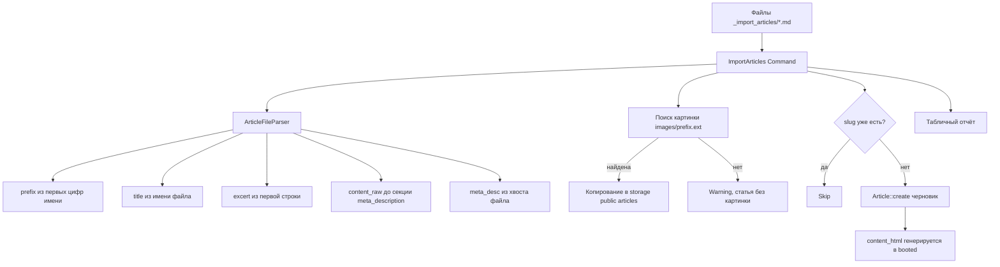

# План: импорт статей из `_import_articles`

> Рабочий документ. Функционал **не реализован** — это согласованный план.
> Статус: ожидает реализации.

## 1. Цель

Артизан-команда, которая импортирует статьи из markdown-файлов в директории `_import_articles/`
в БД (модель [`Article`](../../app/Models/Article.php)). Изображения статей берутся из
`_import_articles/images/` и подбираются по первым цифрам имени файла статьи.

## 2. Согласованные правила

| Аспект | Правило |
|---|---|
| **Title** | Имя файла без расширения `.md`, срезан ведущий номер с разделителем. Пример: `01 - Кода, GigaCode, OpenCode: сравнение код-агентов для VS Code.md` → «Кода, GigaCode, OpenCode: сравнение код-агентов для VS Code» |
| **Excert** | Первая непустая строка файла (курсивный подзаголовок), снимается markdown-разметка `*...*`; если строка — разделитель `---`, берётся следующая. Полю `excert` |
| **Content (`content_raw`)** | Весь текст файла **до** секции `## meta_description` (включая строку-excert, она часть файла) |
| **Meta description (`meta_desc`)** | Всё, что после строки `## meta_description` (regex `^##\s+meta_description\s*$`, без учёта регистра) и до конца файла → `meta_desc`. Сам заголовок и текст секции из `content_raw` **вырезаются**. Если секции нет — `meta_desc = null`, контент = весь файл |
| **Картинка** | Префикс = ведущие цифры имени файла (`01`). В `_import_articles/images/` ищем файл, чьё имя **без расширения строго равно** префиксу (`01.png`). Допустимые расширения: `jpg, jpeg, png, webp, gif, avif`. Найдено несколько — берём первый + warning; ни одного — warning, статья импортируется без картинки |
| **Хранение картинки** | Копируется в `storage/app/public/articles/{оригинальное имя}`, в БД путь `articles/...` (та же логика, что в [`ArticleListScreen::createOrUpdateArticle()`](../../app/Orchid/Screens/Article/ArticleListScreen.php)) |
| **Рубрика** | Обязательная опция `--rubric=ID`; валидация существования рубрики |
| **Статус публикации** | Черновик: `is_published = false`, `published_at = null` |
| **Автор** | Опция `--user=ID`; по умолчанию — первый пользователь с `isAdmin()` (см. [`User::isAdmin()`](../../app/Models/User.php)) |
| **Дубли** | Если `Article` с таким `slug` (из title) уже существует — файл пропускается (`skipped`), включая удалённые (SoftDeletes: проверять `withTrashed()`) |
| **Исходные файлы** | Не удаляются, остаются на месте |
| **Теги / keywords** | Не заполняются при импорте |

## 3. Архитектура



## 4. Файлы плана реализации

### 4.1. `app/Services/ArticleFileParser.php` — парсер md-файла

Метод `parse(SplFileInfo $file): array` возвращает:

```php
[
    'prefix'      => string, // ведущие цифры имени файла («01») или '' если цифр нет
    'title'       => string, // имя файла без .md и без номера-префикса
    'excert'      => ?string,
    'content_raw' => string, // текст до секции ## meta_description
    'meta_desc'   => ?string, // текст после заголовка до конца файла, trim
]
```

Алгоритм:

1. `$basename = $file->getBasename('.md')`.
2. `preg_match('/^\d+/', $basename, $m)` → `$prefix`.
3. Title: убрать префикс и следующий за ним разделитель: regex `^\d+\s*[-–—._]?\s*` (поддержка кириллического дефиса). Если результат пустой — файл считается битым (ошибка, `error`).
4. Чтение содержимого, унификация переводов строк (`\r\n` → `\n`), разбивка на строки.
5. Поиск индекса строки-заголовка: `preg_match('/^##\s+meta_description\s*$/i', $line)`.
   - Найдено: `meta_desc = trim(implode("\n", строки_после_индекса))`; `content_raw = implode("\n", строки_до_индекса)` (без строки заголовка).
   - Не найдено: `meta_desc = null`; `content_raw = весь файл`.
6. Excert: первая непустая строка из `content_raw`; если начинается и заканчивается `*` или `_` — снять разметку (`preg_match('/^\*+(.*)\*+$/s'` и `/_+(.*)_+$/s`); если строка — горизонтальный разделитель (`---`, `***`, `___`) — взять следующую; иначе `null`.

### 4.2. `app/Console/Commands/ImportArticles.php` — команда `articles:import`

Сигнатура:

```
articles:import {--dir= : Директория с md-файлами статей (по умолчанию base_path('_import_articles'))}
               {--rubric= : ID рубрики для всех статей (обязательно)}
               {--user= : ID автора (по умолчанию первый админ)}
               {--dry-run : Показать, что будет импортировано, без записи в БД и копирования файлов}
```

Логика `handle()`:

1. Валидация: `--rubric` обязателен и рубрика существует; иначе `$this->error(...)` и `return Command::FAILURE`. Если задан `--user` — пользователь существует.
2. Определить `$authorId`: `--user` или первый пользователь с `isAdmin()`, иначе первый пользователь, иначе `0` (предупреждение).
3. Собрать `*.md` файлы из `--dir` (по умолчанию `base_path('_import_articles')`), отсортировать по имени (`natcasesort`). Если директории нет — ошибка.
4. Для каждого файла:
   - `ArticleFileParser::parse()` → данные (при ошибке — строка `error` в отчёте, continue).
   - Вычислить `$slug = Str::slug($title)`.
   - `--dry-run` → собрать строку отчёта `planned`, не писать.
   - Проверка дубля: `Article::withTrashed()->where('slug', $slug)->exists()` → `skipped`.
   - Поиск картинки: префикс → файл в `{dir}/images/{prefix}.{ext}` (перебор допустимых расширений). Найдено — `Storage::disk('public')->putFileAs('articles', $абсолютный_путь)` (оригинальное имя сохраняется), в БД `image = 'articles/' . basename`.
   - `DB::transaction`: `Article::create([...])` — `content_html` и slug-уникализация уже обрабатываются в [`Article::booted()`](../../app/Models/Article.php) (передаём готовый slug; при коллизии booted() добавит суффикс — тогда сохранить фактический slug из модели для отчёта).
   - Статус `imported`.
5. Табличный отчёт: `Файл | Title | Картинка | meta_desc | Статус`.
6. Итоговая сводка: `Импортировано: N, пропущено: M, ошибок: K`.
7. `return Command::SUCCESS`.

Edge case: два файла с одинаковым префиксом (`01 - A.md`, `01 - B.md`) — оба получат картинку `01.*`, вывести warning о повторе префикса.

### 4.3. `Makefile` — цель

```make
.PHONY: import-articles
import-articles: ## Импортировать статьи из _import_articles (php artisan articles:import $(ARGS))
	@echo "$(GREEN)→ Importing articles from _import_articles...$(RESET)"
	$(COMPOSE) exec app php artisan articles:import $(ARGS)
```

Запуск: `make import-articles ARGS="--rubric=1 --dry-run"` (см. список целей `make help`).
Корень проекта смонтирован в контейнер `app` как `/var/www` (`docker/docker-compose.yml`), поэтому папка `_import_articles` доступна команде без изменений Docker.

### 4.4. `tests/Feature/ImportArticlesCommandTest.php` — тесты

Фикстуры создаются в временной директории внутри теста (например, `storage/app/testing-import`), чтобы не трогать реальную `_import_articles`:

- `test_import_creates_article_with_all_fields`: файл с секцией `## meta_description` + `images/01.png` → статья создана: title/excert/meta_desc/content_raw без секции, `image = articles/01.png`, `is_published = false`, `published_at = null`, `rubric_id` задан; файл скопирован на диск `public`.
- `test_import_without_meta_section`: `meta_desc = null`, контент содержит весь текст.
- `test_import_without_image`: warning, статья создана с `image = null`.
- `test_import_skips_duplicates`: повторный запуск — количество статей не изменилось, статус `skipped`.
- `test_import_dry_run`: после `--dry-run` статей нет, файлы не скопированы.
- `test_import_requires_rubric`: без `--rubric` команда возвращает `Command::FAILURE`.
- `test_import_strips_markdown_italics_from_excert`: excert без `*...*`.

Замечание: в тестах с `$this->artisan()` используем `Storage::fake('public')`, чтобы не писать в реальное хранилище.

### 4.5. Документация (опционально)

Краткое описание в `README.md` (раздел про команды/возможности) или в `docs/public-template-plan.md` — только после согласования, так как это dev-инструмент, а не публичная фича шаблона.

## 5. Затрагиваемые файлы

| Файл | Действие |
|---|---|
| `app/Services/ArticleFileParser.php` | создать |
| `app/Console/Commands/ImportArticles.php` | создать |
| `Makefile` | дополнить целью `import-articles` |
| `tests/Feature/ImportArticlesCommandTest.php` | создать |
| `README.md` / `docs/*` | опционально |

## 6. Ручная проверка

```bash
make import-articles ARGS="--rubric=1 --dry-run"   # предпросмотр без записи
make import-articles ARGS="--rubric=1"             # реальный импорт
# проверить в /nexus -> Статьи: появились черновики с картинками
# на сайте черновики не видны (is_published=false)
```

## 7. Что НЕ входит в объём

- Расписание импорта в `routes/console.php` (команда запускается вручную).
- Удаление исходных `.md` файлов после импорта.
- Парсинг тегов/keywords из файла.
- Перезапись существующих статей (дубли всегда пропускаются).
