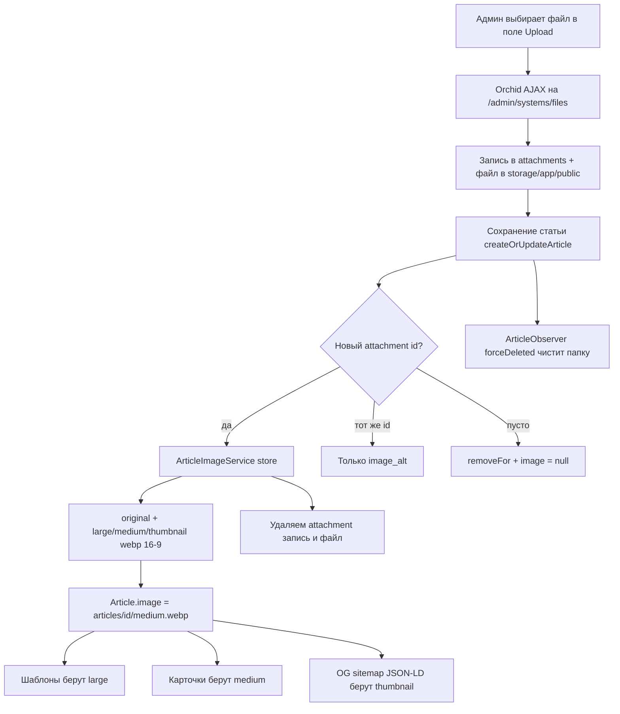

# План: загрузка изображений к статьям (hero + варианты WebP)

Источник требований: `plans/add-images.md` (промт для AI-ассистента).
План адаптирован под **реальную** архитектуру репозитория: Laravel 13, админка Orchid Platform 14 (модальные формы), Blade/Vite-фронтенд, работа только через Docker.

---

## 0. Сверка с реальностью: чем план отличается от исходного промта

| Пункт промта | Реальность проекта | Как учтено |
|---|---|---|
| Laravel 11, Filament/nova или Blade-форма | Laravel 13 + **Orchid Platform 14**, форма статьи — `Rows`-layout в модалке (`app/Orchid/Layouts/CreateOrUpdateArticle.php`) | Поле загрузки делаем полем Orchid `Upload`, а не Blade-формой |
| «диск public», `Storage::url()` отдаёт `/storage` | `FILESYSTEM_DISK=local` в `.env.example` → `Storage::url()` и `Storage::exists()` без указания диска смотрят **не туда** | Везде явно `Storage::disk('public')` |
| `intervention/image` или medialibrary | Пакетов нет; в `docker/app/DockerFile` GD собран **без JPEG/WebP** (только `libpng-dev`) | Этап 1: доустановка библиотек и пересборка контейнера |
| Resize «по длинной стороне» + жёсткие `width="1600" height="900"` в HTML | Противоречие: при сохранении пропорций размеры не константны → CLS | Кадрируем варианты **16:9 (cover)** — константные размеры, нет CLS |
| WYSIWYG-загрузчик картинок в контент | Редактор — `SimpleMDE` (markdown, загрузчика нет) | Пропускаем для MVP, опциональный endpoint в этапе 10 |
| Удаление файлов при удалении статьи | Паттерн проекта: единственный обсервер `ArticleObserver` | Чистка папки в `forceDeleted` (мягкое удаление не трогает файлы — работает restore) |

### Ключевые факты кодовой базы

- `app/Models/Article.php`: колонка `image` есть (`text`, nullable), в `$fillable`; поля `image_alt` **нет**.
- `app/Http/Requests/ArticleRequest.php`: валидирует dotted-поля `article.*`; правил для `image` нет.
- `app/Orchid/Screens/Article/ArticleListScreen.php`: `createOrUpdateArticle(ArticleRequest)` через `updateOrCreate` + `tags()->sync()`; `asyncGetArticle` наполняет модалку редактирования.
- `app/Services/ArticleService.php`: `SELECT_COLUMNS` уже включает `image`.
- Шаблоны: `resources/views/article.blade.php` (градиент-заглушка `.article-hero`), `resources/views/index.blade.php` (градиент `.post-image.image-one` только у featured-карточки).
- SEO: `layouts/techlog.blade.php` (og/twitter), `includes/jsonld.blade.php`, `SitemapController`, `FeedController` — все используют `Storage::url($article->image)` **без диска** и `Seo::absoluteUrl()`.
- Орchid: миграция `attachments` существует; поле `Upload` грузит файлы сразу AJAX-ом на `/admin/systems/files` (работает в модалках без multipart), кладёт записи в таблицу `attachments`.
- Тесты: PHPUnit, `RefreshDatabase`, прямой вызов метода экрана с `ArticleRequest` (см. `tests/Feature/ArticleListScreenTest.php`); очередь в тестах форсируется в `sync`.
- README, раздел «Чего пока нет» (строка ~72): загрузка изображений не подключена — после реализации обновить.

---

## 1. Принятые решения

1. **Пакет**: `intervention/image` (v3) — генерация WebP-вариантов. Требует GD с поддержкой JPEG и WebP.
2. **Схема хранения** (`storage/app/public/articles/{id}/`):
   - `original.{ext}` — оригинал;
   - `large.webp` — 1600×900, q82 — hero на странице статьи;
   - `medium.webp` — 800×450, q80 — карточки в списках (**это значение пишется в `Article::image`**);
   - `thumbnail.webp` — 400×225, q75 — OG/Twitter, sitemap, JSON-LD-превью.
3. **Кадрирование**: все варианты — фиксированный кадр 16:9 (resize + center-crop). Стабильные `width`/`height` в HTML, нулевой CLS.
4. **Поле в админке**: Orchid `Upload::make('article.image')` с `maxFiles(1)` + мост `Attachment → наш каталог` через сервис. Стандартный механизм Orchid, без кастомного multipart в модалке.
5. **Удаление файлов**: замена изображения — синхронно в сервисе; жёсткое удаление статьи — в `ArticleObserver::forceDeleted` (сохраняется паттерн «один обсервер»; `deleted`/`restored` файлы не трогают).
6. **Контентные изображения** (п. 6 промта): `SimpleMDE` не умеет загрузку → в MVP не делаем; опциональный endpoint — этап 10.
7. **Очередь**: конвертация синхронная (лимит 5 МБ, файлы небольшие). Queued job `ProcessArticleImage` — только как будущее расширение, не входит в MVP.

---

## 2. Этапы работ

### Этап 1. Инфраструктура: Docker + пакет

1.1. `docker/app/DockerFile`:
- добавить `libjpeg-dev libwebp-dev` в `apt-get install`;
- перед `docker-php-ext-install gd` выполнить `docker-php-ext-configure gd --with-jpeg --with-webp`;
- пересобрать: `make up --build` (или `docker compose -f docker/docker-compose.yml build app && make up`).

1.2. Установить пакет: `make composer require intervention/image` (v3, в `composer.json` появится `intervention/image`).

1.3. Проверить окружение: `make php` → `php -r "var_dump(gd_info()['WebP Support']);"` должен быть `true`.

### Этап 2. Миграция и модель

2.1. Миграция `add_image_alt_to_articles_table`:

```php
Schema::table('articles', function (Blueprint $table) {
    $table->string('image_alt')->nullable()->after('image');
});
```

2.2. `app/Models/Article.php`:
- `'image_alt'` → `$fillable` и `@property` в docblock;
- accessors:
  - `getImageLargeAttribute(): ?string` — `Str::replace('medium.webp', 'large.webp', $this->image)`;
  - `getImageThumbnailAttribute(): ?string` — `Str::replace('medium.webp', 'thumbnail.webp', $this->image)`;
  - оба возвращают `null`, если `image` пуст.

### Этап 3. Сервис `ArticleImageService`

Новый файл `app/Services/ArticleImageService.php`:

- константа `SIZES = ['large' => [1600, 900, 82], 'medium' => [800, 450, 80], 'thumbnail' => [400, 225, 75]]`;
- `store(Article $article, Attachment $attachment): void`:
  1. проверить mime (`jpeg/png/webp`) и размер (≤ 5 МБ) файла вложения; иначе — `Toast::error` и возврат без изменений;
  2. скопировать оригинал в `public/articles/{id}/original.{ext}`;
  3. сгенерировать 3 варианта WebP (16:9 cover) через `Intervention\Image\ImageManager` (GD-драйвер);
  4. `$article->update(['image' => 'articles/{id}/medium.webp'])`;
  5. удалить вложение: строка `attachments` + файл (чтобы не плодить дубликаты);
- `removeFor(Article $article): void` — `Storage::disk('public')->deleteDirectory('articles/{id}')` (идемпотентно);
- `previewAttachment(Article $article): ?Attachment` — find-or-create записи `Attachment` (disk `public`, path = текущий `article.image`) для показа превью в поле `Upload` при редактировании;
- приватный `variantPath(Article $article, string $size): string`.

### Этап 4. Админка Orchid

> ✅ Выполнен. Изменены 4 файла: `CreateOrUpdateArticle.php`, `ArticleRequest.php`, `ArticleListScreen.php`, `ArticleListScreenTest.php`.

4.1. `app/Orchid/Layouts/CreateOrUpdateArticle.php` — добавить в `fields()`:

```php
Upload::make('article.image')
    ->storage('public')
    ->title('Изображение статьи')
    ->accept('image/*')
    ->maxFiles(1),
Input::make('article.image_alt')->title('Alt-текст изображения')
    ->placeholder('Опишите изображение для скринридеров и SEO'),
```

4.2. `app/Http/Requests/ArticleRequest.php` — новые правила:

```php
'article.image'     => ['nullable', 'array'],
'article.image.*'   => ['integer', 'exists:attachments,id'],
'article.image_alt' => ['nullable', 'string', 'max:255'],
```

4.3. `app/Orchid/Screens/Article/ArticleListScreen.php`:
- `asyncGetArticle()`: вернуть `image` как `[$service->previewAttachment($article)->id]` (или `[]`) и `image_alt`;
- `createOrUpdateArticle()`: после `updateOrCreate` — логика синхронизации изображения:
  - `$newIds = $request->input('article.image', [])`; `$registered = $service->previewAttachment($article)` (после сохранения);
  - если появился **новый** id (отличается от зарегистрированного) → `$service->store($article, Attachment::find($id))` (внутри заменит файлы и удалит старое вложение + зарегистрированное);
  - если список **пуст** и ранее изображение было → `$service->removeFor($article)` + `image = null`;
  - если id **совпадает** → ничего с файлами не делаем;
  - в любом случае сохранить `image_alt` (поле уже в `fillable`).

4.4. **Пермишен**: AJAX-эндпоинт Upload требует `platform.systems.attachment`. Убедиться, что роль/пользователь админа (`admin@localhost.ru`) его имеет (выдать вручную в админке или через сидер); иначе загрузка вернёт 403.

### Этап 5. Удаление файлов при удалении статьи

5.1. `app/Observers/ArticleObserver.php` — в `forceDeleted()` дополнительно `app(ArticleImageService::class)->removeFor($article)`. `deleted()`/`restored()` не трогают.

### Этап 6. Публичные шаблоны

6.1. `resources/views/article.blade.php` — вместо градиента выводить реальный ``:

```blade
@if($article->image)
    url($article->image_large)) }}"
         alt="{{ $article->image_alt ?: $article->title }}"
         width="1600" height="900"
         loading="eager" fetchpriority="high" decoding="async">
@else
    <div class="article-hero" style="background: ..."></div>
@endif
```

6.2. `resources/views/index.blade.php` — карточки списка:
- featured-карточка (`$index === 0`): вместо градиента `.post-image.image-one` — ``;
- остальные карточки: добавить миниатюру `` (`loading="lazy"`), если изображение есть; `alt = image_alt ?: title`.

6.3. SCSS (`resources/sass/techlog/_components.scss` или `_base.scss`): стили `.article-hero-img` и `.post-image img` — `width: 100%; height: auto; display: block; border-radius: ...; aspect-ratio: 16/9; object-fit: cover;` (aspect-ratio как страховка от CLS).

### Этап 7. SEO-интеграция

7.1. `resources/views/layouts/techlog.blade.php` (обе ветки — статья и остальные):
- `og:image` / `twitter:image` на странице статьи: `Seo::absoluteUrl(Storage::disk('public')->url($article->image_thumbnail))` с fallback на `config('seo.og_image')` (fallback уже реализован — заменить только URL);
- попутно добавить `og:image:width="400"` / `og:image:height="225"` (опционально).

7.2. `resources/views/includes/jsonld.blade.php` — блок `image` для статьи:
- `url` / `contentUrl` → `image_large`;
- `width` 1600, `height` 900;
- `caption` → `image_alt ?: title`.

7.3. `app/Http/Controllers/SitemapController.php`:
- `Storage::exists(...)` → `Storage::disk('public')->exists(...)`;
- `<image:url>` → `thumbnail.webp`;
- добавить `<image:caption>` = `image_alt ?: title`;
- в `publishedArticles()` добавить `image_alt` в `select`.

7.4. `app/Http/Controllers/FeedController.php`:
- `Storage::exists/size` → `Storage::disk('public')`;
- `type="image/jpeg"` в `<enclosure>` → фактический формат `image/webp` (варианты теперь WebP); URL оставить на medium (или переключить на large — на усмотрение).

### Этап 8. Тесты

8.1. Новый `tests/Feature/ArticleImageTest.php` (паттерн — как `ArticleListScreenTest`, прямой вызов `createOrUpdateArticle`):
- загрузка: `Storage::fake('public')`, создать `Article` + `Attachment` с PNG-файлом, вызвать метод экрана с `article[image][]=id` → `assertExists` всех 4 файлов, `article.image === articles/{id}/medium.webp`;
- невалидный тип/размер (txt, >5 МБ) → изображение не сохранено;
- замена: второй attachment → старые файлы удалены, новые созданы;
- `forceDelete` статьи → папка `articles/{id}` удалена;
- GET-страница статьи с изображением → в HTML `og:image` содержит абсолютный URL с `thumbnail.webp`;
- страница без изображения → `og:image` = `config('seo.og_image')` (fallback);
- sitemap.xml → `image:url` указывает на `thumbnail.webp`.

8.2. Прогнать: `make test` (обновить затронутые `SitemapTest`/`SeoMetaTest` при необходимости).

### Этап 9. Документация

9.1. `README.md`:
- убрать пункт «Чего пока нет: загрузка изображений к статьям» (~строка 72) и строку про логотип/OG (~строка 230);
- добавить фичу в «✨ Возможности "из коробки"» (hero-изображение, WebP-варианты, alt, og:image/sitemap/RSS);
- при необходимости — обновить раздел про `attachments` и пермишен `platform.systems.attachment`.

9.2. `AGENTS.md` — в «Gotchas» добавить: изображения лежат на диске `public` в `articles/{id}/`, в `Article::image` путь к `medium.webp`, варианты `large/thumbnail`, `image_alt`, очистка при `forceDeleted`, везде явный `Storage::disk('public')` (дефолт `local`!).

9.3. `docs/architecture.md` — дополнить описание потока загрузки (опционально).

### Этап 10 (опционально). Изображения внутри контента

10.1. Файл `routes/platform.php` (Orchid автоматически подхватывает его при наличии) + контроллер/экшен:
- `POST /admin/articles/{article}/upload-content-image` (под `auth` + `access:platform.custom.articles`);
- приём `file`, валидация jpeg/png/webp ≤ 5 МБ, сохранение в `public/articles/{id}/content/{timestamp}.webp`, ответ `{ url: "абсолютный URL" }`;
- админ вставляет в markdown ``. SimpleMDE-подсказку/кнопку не делаем.

---

## 3. Диаграмма потока загрузки



## 4. Риски и обязательные проверки

- **Upload в модалке**: проверить в браузере (`:8080/admin`, создать/отредактировать статью с картинкой) — загрузка чипа и предпросмотр при редактировании.
- **Пермишен `platform.systems.attachment`** — без него Upload вернёт 403.
- **GD + WebP**: без пересборки контейнера (этап 1.1) конвертация упадёт; проверять `gd_info()['WebP Support']`.
- **Диск**: любой доступ к файлам — только `Storage::disk('public')`; дефолтный диск `local` даст неверные URL и «не найденные» файлы.
- **`image_alt` в выборках**: в `SitemapController::publishedArticles()` обязательно добавить колонку в `select`, иначе `image_alt` будет `null`.
- **Пропорции**: варианты кадрируются 16:9 — иначе жёсткие `width/height` в HTML соврут и появится CLS.

## 5. Критерии готовности

- [ ] `gd_info()['WebP Support'] === true` в контейнере `blog_app`, пакет `intervention/image` в `composer.json`;
- [ ] миграция `image_alt` применена (`make migrate`);
- [ ] в админке у статьи загружается/заменяется/удаляется изображение, при редактировании видно превью;
- [ ] на странице статьи — hero `` (large.webp) с alt и атрибутами размеров; без картинки — прежняя градиент-заглушка;
- [ ] в карточках списков — lazy-миниатюры medium.webp;
- [ ] `og:image`/`twitter:image`/JSON-LD/sitemap/RSS отдают абсолютные URL нужных вариантов с fallback на `seo.og_image`;
- [ ] при жёстком удалении статьи папка `articles/{id}` удаляется, при мягком — сохраняется;
- [ ] `make test` зелёный (включая новые тесты `ArticleImageTest`);
- [ ] README и AGENTS.md обновлены, «Чего пока нет» про изображения убрано.
