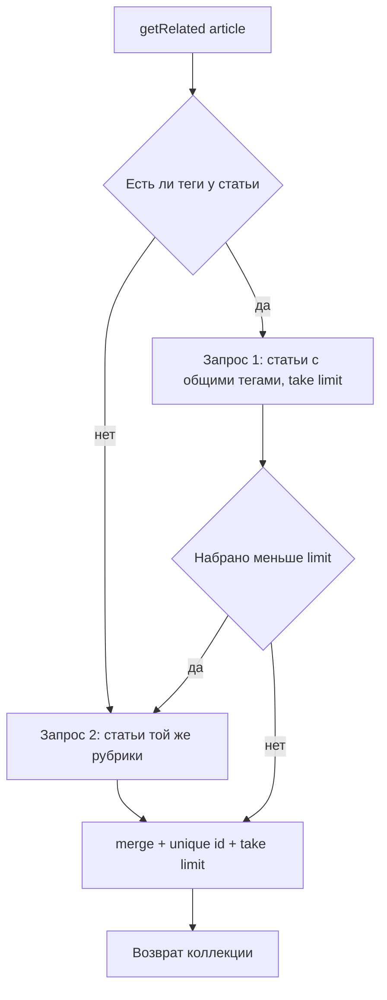

# План: функционал «Похожие статьи»

## 1. Цель и место в архитектуре

- **Что делаем:** блок «Похожие статьи» на странице публикации — до 3 карточек статей, похожих по тегам и рубрике. Без JS, без новых маршрутов и эндпоинтов.
- **Куда встраиваем (конвенция проекта, см. AGENTS.md):**
  - выборка — в [`app/Services/ArticleService.php`](app/Services/ArticleService.php) (там уже живут все выборки статей);
  - передача данных — в [`app/Http/Controllers/ArticleController.php`](app/Http/Controllers/ArticleController.php:40) (`show()`);
  - разметка — новый партиал `resources/views/includes/related_articles.blade.php`;
  - подключение — [`resources/views/article.blade.php`](resources/views/article.blade.php);
  - стили — [`resources/sass/techlog/_components.scss`](resources/sass/techlog/_components.scss) и `_responsive.scss`.
- **Ключевые правила:**
  - показываем **только опубликованные** статьи (`is_published = true` и `published_at <= now` через существующий `Article::published()`);
  - переиспользуем существующие стили карточек `.post` и константу `ArticleService::SELECT_COLUMNS`;
  - eager loading (`tags`, `rubric`) — без N+1;
  - блог — публичный шаблон: логика не должна зависеть от админки Orchid.

## 2. Проверка БД и индексов (миграция НЕ требуется)

Пункт исходного плана про «проверить/добавить индексы» уточнён по факту структуры:

- [ ] Проверить, что индексы уже созданы движком MySQL автоматически:
  - `articles.rubric_id` — индекс от внешнего ключа `constrained()` в [`2022_05_19_124837_create_articles_table.php`](database/migrations/2022_05_19_124837_create_articles_table.php:19);
  - `article_tags.article_id` и `article_tags.tag_id` — индексы от FK в [`2022_05_19_125140_create_article_tags.php`](database/migrations/2022_05_19_125140_create_article_tags.php:19).
- [ ] Новой миграции не создаём — для объёмов блога этих индексов достаточно.
- [ ] Опционально (вне рамок задачи): составной индекс `(tag_id, article_id)` в `article_tags` — только если позже появится реальная нагрузка.
- [ ] Убедиться, что связь многие-ко-многим настроена: `Article::tags()` → `belongsToMany(Tag::class, 'article_tags')` — уже есть в [`app/Models/Article.php`](app/Models/Article.php:170).

## 3. Логика выборки — метод `ArticleService::getRelated()`

Добавить в [`app/Services/ArticleService.php`](app/Services/ArticleService.php) метод:

```php
public function getRelated(Article $article, int $limit = 3): \Illuminate\Database\Eloquent\Collection
```

Алгоритм (приоритет: совпадение по тегам → добор по рубрике):



- [ ] **Шаг 1 — по тегам** (пропускается, если у статьи нет тегов):
  - `$tagIds = $article->tags->pluck('id')`;
  - `Article::published()->where('id', '!=', $article->id)->whereHas('tags', fn (Builder $q) => $q->whereIn('tags.id', $tagIds))->select(self::SELECT_COLUMNS)->with(['tags', 'rubric'])->take($limit)->get()`.
- [ ] **Шаг 2 — добор по рубрике**, если набрано меньше `$limit`:
  - `Article::published()->where('rubric_id', $article->rubric_id)->where('id', '!=', $article->id)->whereNotIn('id', $alreadyIds)->select(self::SELECT_COLUMNS)->with(['tags', 'rubric'])->take($limit - $count)->get()`.
- [ ] Объединить результат: `->merge($byRubric)->unique('id')->take($limit)`.
- [ ] Только опубликованные статьи: `Article::published()` сам фильтрует черновики и «будущие» записи (сравнение по полному timestamp) и сортирует `published_at desc`.
- [ ] Ограничение полей: переиспользовать существующую константу `SELECT_COLUMNS` (id, title, slug, excerpt, image, published_at, rubric_id, is_published, content_raw) + `with(['tags', 'rubric'])` — без N+1.
- [ ] Крайний случай: похожих нет → возвращаем пустую коллекцию (блок в шаблоне скрывается).
- [ ] Пустая коллекция тегов у текущей статьи → сразу запрос по рубрике.

> Решение по архитектуре: метод живёт в `ArticleService`, а не в модели `Article` (в исходном плане предлагалось `related()` в модели). Это соответствует принципу проекта «тонкие контроллеры и сервисы» и паттерну существующих методов `getByRubric`/`getByTag`.

## 4. Контроллер

- [ ] В [`ArticleController::show()`](app/Http/Controllers/ArticleController.php:40) после `withToc(...)` добавить:

```php
$relatedArticles = $this->service->getRelated($article);
```

- [ ] Передать в `view('article', [...])` ключ `'relatedArticles' => $relatedArticles`.
- [ ] Отдельный маршрут / JSON-эндпоинт **не создаём** — публичный блог, AJAX не нужен, рендер серверный.
- [ ] Права и доступ Orchid **не затрагиваются** — фича публичная. Пункт исходного плана про «проверить права в Orchid» неактуален и удалён.

## 5. Blade-партиал `includes/related_articles.blade.php`

- [ ] Создать файл `resources/views/includes/related_articles.blade.php` (конвенция именования партиалов проекта — `includes/*.blade.php`, без нижнего подчёркивания; примеры: `comments_list`, `breadcrumbs`).
- [ ] Разметка:
  - секция с классом `.section.container` и заголовком `<h2>Похожие статьи</h2>`;
  - сетка `.related-grid` из карточек `.post` (переиспользуем существующие стили):
    - изображение: `@if($related->image) image) }}" ... loading="lazy">`;
    - дата: `{{ \Carbon\Carbon::parse($related->published_at)->locale('ru')->isoFormat('D MMM YYYY') }}` (как на главной в [`index.blade.php`](resources/views/index.blade.php:67));
    - заголовок-ссылка: `route('articleShow', ['article' => $related->slug])`;
    - при желании — короткий `excerpt` (`Str::limit`).
- [ ] Условие вывода: `@if(($relatedArticles ?? collect())->isNotEmpty())` — блок скрыт при пустой выборке.
- [ ] Без JS.

## 6. Подключение в представлении статьи

- [ ] В [`resources/views/article.blade.php`](resources/views/article.blade.php:54) вставить `@include('includes.related_articles')`:
  - после закрытия `</article>` (конец контента);
  - перед `<section class="section comments container" id="comments">` (логичный порядок: статья → похожие → комментарии).
- [ ] `$relatedArticles` приходит из контроллера, в партиале отдельная передача данных не нужна.

## 7. Стили (SCSS)

- [ ] В [`resources/sass/techlog/_components.scss`](resources/sass/techlog/_components.scss:321) рядом с блоком `Masonry / Posts` добавить:

```scss
.related-grid {
    display: grid;
    grid-template-columns: repeat(3, 1fr);
    gap: 20px;

    .post { margin: 0; }
}
```

- [ ] В [`resources/sass/techlog/_responsive.scss`](resources/sass/techlog/_responsive.scss) — адаптив: `repeat(2, 1fr)` на планшете, `1fr` на мобильных (рядом с существующими правилами для `.post`).
- [ ] Примечание: сетка делается отдельным классом `.related-grid`, а не `.masonry` (CSS `columns` заполняет колонки вертикально и даёт неожиданный порядок карточек для компактного блока).

## 8. Тесты

Исходный план тесты не содержал — добавляем обязательный этап (AGENTS.md: «при изменении доменной логики обновляй или добавляй тесты»).

- [ ] `tests/Unit/ArticleServiceTest.php` — новые тесты для `getRelated()`:
  - возвращает статьи с совпадающими тегами (приоритет над рубрикой);
  - добирает статьями той же рубрики, когда по тегам меньше лимита;
  - исключает текущую статью;
  - не включает черновики и статьи с будущим `published_at`;
  - ограничивает результат (максимум 3);
  - сортирует по `published_at desc`;
  - возвращает пустую коллекцию, если похожих нет;
  - корректно работает для статьи без тегов (сразу выборка по рубрике).
- [ ] Feature-тест (добавить в `tests/Feature/PublicPagesTest.php` или отдельный `RelatedArticlesTest.php`):
  - страница статьи показывает блок «Похожие статьи» с заголовками похожих статей;
  - блок скрыт, когда похожих статей нет;
  - неопубликованная статья не появляется в блоке похожих.

## 9. Документация

- [ ] `README.md`: добавить строку о блоке «Похожие статьи» в раздел «✨ Возможности из коробки».
- [ ] `docs/architecture.md`: описать метод `ArticleService::getRelated()` и партиал `includes/related_articles.blade.php`.

## 10. Проверка

- [ ] `make lint` — синтаксис PHP без ошибок.
- [ ] `make test` — все тесты зелёные (PHPUnit).
- [ ] Ручная проверка: `make up`, открыть статью с тегами и без них — блок «Похожие статьи» показывает 1–3 карточки, корректно адаптируется, не падает при пустой выборке; проверить тёмную тему.
