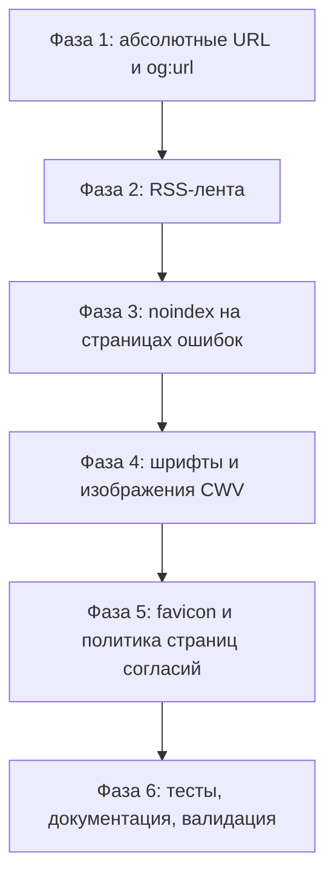

# План SEO-оптимизации блога — этап 2 (аудит 2026-09)

> Статус: черновик для согласования.
> Этап 1 (базовый SEO) реализован и задокументирован — см. исторический план
> [`plans/seo-optimization.md`](plans/seo-optimization.md) и раздел «SEO» в
> [`README.md`](README.md). Этот план описывает **следующий шаг**: устранение
> пробелов, найденных при аудите фактического кода. Все тексты на русском,
> без привязки к доменам и личным данным (правила публичного шаблона).

## 1. Что уже реализовано (не трогаем без нужды)

- Мета-разметка `title`/`description`/`canonical`/`robots`/OG/Twitter — единый
  источник [`resources/views/layouts/techlog.blade.php`](resources/views/layouts/techlog.blade.php:9)
  + дефолты в [`config/seo.php`](config/seo.php:11).
- JSON-LD (WebSite+SearchAction, Organization, Article, BreadcrumbList) —
  [`resources/views/includes/jsonld.blade.php`](resources/views/includes/jsonld.blade.php:6),
  выводится только на индексируемых страницах.
- Sitemap с кэшем 1 час и `image:image` — [`app/Http/Controllers/SitemapController.php`](app/Http/Controllers/SitemapController.php:17).
- Динамический robots.txt — [`app/Http/Controllers/RobotsController.php`](app/Http/Controllers/RobotsController.php:12).
- Slug-URL рубрик/тегов + 301 с числовых id — [`routes/web.php`](routes/web.php:68),
  автогенерация slug в [`app/Models/Rubric.php`](app/Models/Rubric.php:60) и
  [`app/Models/Tag.php`](app/Models/Tag.php:61).
- H1-иерархия — [`resources/views/index.blade.php`](resources/views/index.blade.php:48).
- Хлебные крошки — [`resources/views/includes/breadcrumbs.blade.php`](resources/views/includes/breadcrumbs.blade.php:7)
  + [`app/Services/BreadcrumbService.php`](app/Services/BreadcrumbService.php:23).
- nginx: gzip, кэш `/build` и `/storage` — [`docker/nginx/conf.d/nginx.conf`](docker/nginx/conf.d/nginx.conf:13).
- Тесты: [`tests/Feature/SeoMetaTest.php`](tests/Feature/SeoMetaTest.php:12),
  [`tests/Feature/SitemapTest.php`](tests/Feature/SitemapTest.php),
  [`tests/Feature/RedirectTest.php`](tests/Feature/RedirectTest.php).

## 2. Результаты аудита: найденные пробелы

| # | Проблема | Где | Влияние |
|---|----------|-----|---------|
| 1 | `og:image`, `twitter:image`, JSON-LD image и `<image:url>` в sitemap используют `Storage::url()` → **относительный** `/storage/...` без домена; `og:image` из `config('seo.og_image')` тоже может быть относительным | [`techlog.blade.php`](resources/views/layouts/techlog.blade.php:47), [`jsonld.blade.php`](resources/views/includes/jsonld.blade.php:110), [`SitemapController.php`](app/Http/Controllers/SitemapController.php:43) | Open Graph, Twitter Card и structured data требуют абсолютных URL; без домена сниппеты и rich-результаты ломаются |
| 2 | `og:url` = `url()->current()` — на `?search=`/`?page=` отличается от canonical | [`techlog.blade.php`](resources/views/layouts/techlog.blade.php:43) | Расхождение сигналов: OG показывает неканоничный URL |
| 3 | Нет RSS/Atom-ленты (в gzip уже включён `application/rss+xml` — фича была запланирована) | весь проект | Блог без ленты: теряется подписка читателей через фидридеры, меньше внешних ссылок |
| 4 | Страницы ошибок 4xx/5xx наследуют `index,follow` + self-canonical (robots не задан) | [`resources/views/errors/404.blade.php`](resources/views/errors/404.blade.php:3), остальные `errors/*` | Формально разрешают индексацию несуществующих/ошибочных URL (хотя статус 404/500 обычно не индексируется, мета должна быть явной) |
| 5 | Внешние шрифты Google Fonts (render-blocking CSS), нет `preload` | [`techlog.blade.php`](resources/views/layouts/techlog.blade.php:97) | LCP/FCP хуже, лишний запрос к стороннему домену |
| 6 | Изображения в статьях/списках без `loading="lazy"` и размеров (когда фича загрузки картинок появится) | [`index.blade.php`](resources/views/index.blade.php:59), [`article.blade.php`](resources/views/article.blade.php:44) | CLS и лишняя загрузка изображений ниже первого экрана |
| 7 | Нет `apple-touch-icon`; favicon только `.ico` | [`techlog.blade.php`](resources/views/layouts/techlog.blade.php:94) | Мелочь: iOS-закладки без иконки |
| 8 | Страницы текстов согласий `/consent/processing` и `/consent/distribution` не определены в sitemap/robots — решение не зафиксировано | [`routes/web.php`](routes/web.php:46) | Неопределённая политика индексации юридических страниц |

## 3. Решения (что и как делаем)

| Тема | Решение |
|------|---------|
| Абсолютные URL | Везде, где URL отдаётся в мета/структурированные данные/sitemap, приводить к абсолютному виду через `url()` (оборачивает относительный путь доменом из `APP_URL`). Единый helper `App\Support\Seo::absoluteUrl(?string $path): ?string` (или прямо `url()` в шаблонах — helper предпочтительнее для переиспользования и тестов). |
| `og:url` | Использовать уже вычисленный `$canonicalUrl` вместо `url()->current()` в обоих ветках OG-разметки. |
| RSS | Свой контроллер `App\Http\Controllers\FeedController` (без пакетов, по аналогии с `SitemapController`): маршруты `/feed` (Atom) или `/rss` (RSS 2.0) — выбрать RSS 2.0 как де-факто стандарт; кэш 1 час; последние 20 опубликованных статей; `link rel="alternate" type="application/rss+xml"` в `<head>`. |
| Ошибки | В каждой `resources/views/errors/*.blade.php` задать `$metaRobots = 'noindex, nofollow'` (переменная из `@php` дочернего шаблона доступна layout — по аналогии с уже работающим `$metaTitle` в 404). Canonical на страницах ошибок не выводить или оставить self (по статусу HTTP роботы их не индексируют; мета — страховка). |
| Шрифты | Самохостинг `Inter` + `JetBrains Mono` (OFL-лицензии): woff2 в `public/fonts/`, `@font-face` в `resources/sass/techlog/_variables.scss` или отдельном файле, `preload` двух основных начертаний; убрать `<link>` на Google Fonts и preconnect. |
| Изображения | Добавить `loading="lazy"` и `decoding="async"` для картинок в списках и статье; `width`/`height` (или CSS `aspect-ratio`) против CLS — применить сразу, чтобы фича загрузки картинок не требовала доработки. |
| Favicon | Добавить `apple-touch-icon.png` (180×180) и `manifest.webmanifest` (опционально); подключить в `<head>`. |
| Страницы согласий | Решение: оставить индексируемыми (полезные юридические страницы), в sitemap **не** включать (низкая ценность), robots.txt не блокировать. Зафиксировать в README. |
| HTML-кэш | Не внедрять `Cache-Control` для HTML (csrf-токен в `<head>` и сессионные данные несовместимы с агрессивным кэшем; риск для форм). Отметить в README как осознанное решение. |
| `rel=prev/next` | Не добавлять: Google игнорирует; действующая стратегия canonical+noindex для пагинации корректна. |

## 4. Фазы реализации

### Фаза 1. Абсолютные URL изображений и `og:url`

- Новый [`app/Support/Seo.php`](app/Support/Seo.php) (класс-хелпер):
  `absoluteUrl(?string $path): ?string` — `null` → `null`; уже абсолютный (`http(s)://`) → как есть;
  иначе `url($path)` (учитывает `APP_URL`).
- [`resources/views/layouts/techlog.blade.php`](resources/views/layouts/techlog.blade.php:43):
  - `og:url` и `twitter`-блоки — подставить `$canonicalUrl`;
  - `og:image`/`twitter:image` — обернуть `Storage::url(...)` в `\App\Support\Seo::absoluteUrl()`;
  - дефолтную `og:image` из `config('seo.og_image')` — тоже через helper.
- [`resources/views/includes/jsonld.blade.php`](resources/views/includes/jsonld.blade.php:106):
  `image.url`/`image.contentUrl` — через helper.
- [`app/Http/Controllers/SitemapController.php`](app/Http/Controllers/SitemapController.php:37):
  `<image:url>` — через helper (sitemap требует абсолютных URL).
- Проверка: `config('seo.organization_logo')` и `organization_url` — при пустых значениях в JSON-LD не выводить (уже так), при заполнении — убедиться, что значения абсолютные (задокументировать в `config/seo.php`).

### Фаза 2. RSS-лента

- Маршруты в [`routes/web.php`](routes/web.php:19):
  `Route::get('/rss', FeedController::class)->name('feed');` (+ alias `/feed` с 301, если нужно).
- [`app/Http/Controllers/FeedController.php`](app/Http/Controllers/FeedController.php) — новый:
  - кэш `Cache::remember('rss.feed', 3600, ...)` (как в `SitemapController`);
  - выборка: `Article::published()->select('id','slug','title','excert','meta_desc','published_at','updated_at','user_id','image')->orderByDesc('published_at')->limit(20)`;
  - RSS 2.0: `<channel>` (title, link, description, language `ru`, `lastBuildDate`), `<item>` (title, link, guid, pubDate RFC-2822, description из `excert`/`meta_desc`, опционально `<enclosure url=... type="image/jpeg">`);
  - `Content-Type: application/rss+xml; charset=utf-8`.
- [`resources/views/layouts/techlog.blade.php`](resources/views/layouts/techlog.blade.php:95):
  `<link rel="alternate" type="application/rss+xml" title="{{ ... }}" href="{{ route('feed') }}">` в `<head>`.
- robots.txt не блокирует `/rss` (уже так); sitemap-индексация ленты не нужна.

### Фаза 3. noindex на страницах ошибок

- В каждой из [`resources/views/errors/`](resources/views/errors) страниц (400–504, maintenance):
  `@php $metaRobots = 'noindex, nofollow'; @endphp` перед `@section('content')` —
  по аналогии с уже работающим `$metaTitle` в [`errors/404.blade.php`](resources/views/errors/404.blade.php:3).
- Проверить, что JSON-LD на ошибках не выводится (условие `str_contains($metaRobots,'noindex')` уже есть — сработает автоматически).

### Фаза 4. Core Web Vitals: шрифты и изображения

- Самохостинг шрифтов:
  - скачать woff2: Inter 400/500/600/700/800, JetBrains Mono 400/500/600/700;
  - положить в `public/fonts/`;
  - `@font-face` в новом `resources/sass/techlog/_fonts.scss` (подключается из `index.scss`), `font-display: swap`;
  - убрать из [`techlog.blade.php`](resources/views/layouts/techlog.blade.php:97) ссылки на Google Fonts и preconnect;
  - `<link rel="preload" as="font" type="font/woff2" crossorigin>` для Inter 400 и 700.
- Изображения:
  - [`resources/views/index.blade.php`](resources/views/index.blade.php:59) — карточка статьи: `loading="lazy"`, `decoding="async"`, фиксированные размеры/CSS `aspect-ratio`;
  - [`resources/views/article.blade.php`](resources/views/article.blade.php:44) — hero-картинка: те же атрибуты + `fetchpriority="high"` для первой; заглушка-градиент не трогать.

### Фаза 5. Favicon и политика страниц согласий

- Добавить `public/apple-touch-icon.png` (180×180) и подключить в [`techlog.blade.php`](resources/views/layouts/techlog.blade.php:93).
- Опционально `public/site.webmanifest` (name, icons, theme_color).
- Страницы `/consent/processing`, `/consent/distribution`: оставить индексируемыми, в sitemap не включать; зафиксировать решение в README (раздел SEO).

### Фаза 6. Тесты, документация, валидация

- Обновить [`tests/Feature/SeoMetaTest.php`](tests/Feature/SeoMetaTest.php):
  - `og:image`/`twitter:image` — абсолютный URL (содержит `APP_URL`);
  - `og:url` совпадает с canonical на странице поиска (`/?search=...`);
  - `GET /nonexistent` (404) — `<meta name="robots" content="noindex, nofollow">`.
- Новый [`tests/Feature/FeedTest.php`](tests/Feature/FeedTest.php):
  - `GET /rss` → 200, `Content-Type` содержит `application/rss+xml`, в XML есть `<item>` с title/link/guid последней статьи; без статей — пустой канал без ошибок.
- [`tests/Feature/SitemapTest.php`](tests/Feature/SitemapTest.php): `<image:url>` содержит абсолютный URL.
- README: обновить раздел «SEO из коробки» (RSS-лента, noindex на ошибках, самохостинг шрифтов, политика страниц согласий).
- [`AGENTS.md`](AGENTS.md): gotcha про абсолютные URL в мета/JSON-LD/sitemap и про RSS.
- [`docs/architecture.md`](docs/architecture.md): описать `FeedController`, `App\Support\Seo`.
- Ручная валидация (вне CI): Google Rich Results Test, PageSpeed Insights, валидатор Schema.org.

## 5. Критерии готовности

- Все `og:image`/`twitter:image`/JSON-LD image/`<image:url>` в sitemap — абсолютные URL (`{APP_URL}/storage/...`).
- `og:url` на каждой странице совпадает с `link rel="canonical"`.
- `GET /rss` отдаёт валидный RSS 2.0 с последними 20 статьями; в `<head>` есть `<link rel="alternate" type="application/rss+xml">`.
- Страницы ошибок 4xx/5xx отдают `noindex, nofollow` без JSON-LD.
- Шрифты отдаются с домена сайта, без внешних запросов к Google Fonts; изображения с `loading="lazy"` и размерами.
- `make test` и `make lint` зелёные; README/AGENTS.md/docs обновлены.
