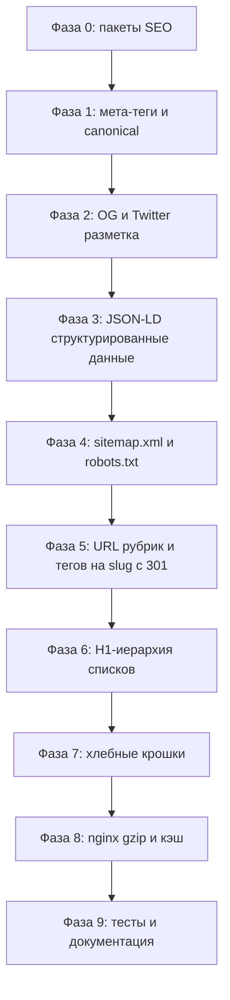

# План SEO-оптимизации блога (Laravel 13 + Orchid Platform)

> Статус: согласован с пользователем. Полный комплекс, реализация через пакеты
> `spatie/laravel-sitemap` + `artesaos/seotools` (план Б — свой лёгкий код без зависимостей,
> если пакеты несовместимы с Laravel 13 / PHP 8.5).
> Все тексты на русском; без привязки к доменам и личным данным (правила публичного шаблона).

## 1. Контекст и результаты аудита

Текущее состояние:

- Мета-разметка инлайн в [`layouts/techlog.blade.php`](../../resources/views/layouts/techlog.blade.php) (строки 9–25);
  есть отдельный legacy-партиал [`includes/meta_tags.blade.php`](../../resources/views/includes/meta_tags.blade.php),
  подключённый только в старом layout [`layouts/base.blade.php`](../../resources/views/layouts/base.blade.php).
- **Баг**: контроллеры передают `metaTitle`/`metaDesc` пустой строкой `''`, а в шаблоне используется
  `$metaTitle ?? default` — оператор `??` срабатывает только на `null`, поэтому `<title>` и
  `og:description` на главной, контактах и метках пустые.
  Примеры: [`ArticleController::index()`](../../app/Http/Controllers/ArticleController.php:23),
  [`ContactController::index()`](../../app/Http/Controllers/ContactController.php:15).
- Нет `<link rel="canonical">` ни на одной странице.
- Нет `sitemap.xml`; [`public/robots.txt`](../../public/robots.txt) пустой (только `User-agent: *` + `Disallow:`).
- Нет структурированных данных JSON-LD (Article, BreadcrumbList, WebSite, Organization).
- Индексируются служебные страницы: поиск `?search=`, страницы пагинации `?page=N`, `/notpublic`
  (есть noindex, но `nofollow`), `/login`, `/register`, `/dashboard`, `/profile`, тестовые `/test-*`,
  `/unsubscribe`, `/consent/revoke`.
- На страницах рубрик/тегов **нет H1**: заголовок `sectionTitle` выводится как `<h2>` в
  [`index.blade.php`](../../resources/views/index.blade.php:47).
- URL рубрик и тегов — `/rubric/{id}` и `/tag/{id}` (implicit binding по id), хотя у обеих моделей
  есть поле `slug` ([`Rubric`](../../app/Models/Rubric.php), [`Tag`](../../app/Models/Tag.php)).
- OG-разметка неполная: нет `og:site_name`, `og:image`, Twitter Card; есть невалидный
  `og:locale:alternate en-SU`.
- Пагинация: `rel=prev/next` есть ([`vendor/pagination/techlog.blade.php`](../../resources/views/vendor/pagination/techlog.blade.php)),
  canonical/noindex нет.
- Производительность: в [`nginx.conf`](../../docker/nginx/conf.d/nginx.conf) нет gzip, cache-control, expires.
- Поля SEO у статьи (`keywords`, `meta_desc`) редактируются в админке
  ([`CreateOrUpdateArticle`](../../app/Orchid/Layouts/CreateOrUpdateArticle.php)), у рубрики есть `description`
  (миграция `2026_09_15_000001_add_description_to_rubrics_table`), у тега описания нет.

## 2. Решения (что и как делаем)

| Тема | Решение |
|------|---------|
| Мета-теги | Единый источник — [`layouts/techlog.blade.php`](../../resources/views/layouts/techlog.blade.php) + новый `config/seo.php` с дефолтами. `??` заменить на `?:` (или нормализовать значения в контроллерах). |
| Canonical | На всех публичных страницах. Списки: 1-я страница — без `?page`; страницы 2+ — self-canonical; поиск — canonical на главную. |
| noindex | `noindex,follow` для: поиска, `page>=2`, `/notpublic`, `/dashboard`, `/profile`, auth-страниц, `/unsubscribe`, `/test-*`, `/consent/revoke`. |
| Структурированные данные | Blade-партиал `includes/jsonld.blade.php`: Article, BreadcrumbList, WebSite+SearchAction, Organization. Только на публичных страницах. |
| Sitemap | Маршрут `/sitemap.xml` через `spatie/laravel-sitemap` (или свой контроллер — план Б). Кэширование результата. Включить: главная, рубрики, теги, опубликованные статьи, `/about`, `/contact`, `/privacy`. `lastmod` из `updated_at`. |
| robots.txt | `Disallow` служебных путей + строка `Sitemap: {APP_URL}/sitemap.xml`. |
| URL рубрик/тегов | Миграция на slug: `{rubric:slug}`/`{tag:slug}`, автогенерация slug в моделях (`booted()`) и админке, бэкфилл существующих записей, 301-редиректы со старых числовых URL. |
| H1 | На рубрике/теге `sectionTitle` → `<h1>`; на главной hero `<h1>` + «Свежие статьи» `<h2>`; ровно один `<h1>` на страницу. Для тегов добавить `description` (опционально, если нужен meta description). |
| Хлебные крошки | Партиал `includes/breadcrumbs.blade.php` + BreadcrumbList JSON-LD + стили в sass. Главная → Рубрика → Статья. |
| Производительность | nginx: gzip, cache-control/expires для `/build` и статики; опционально HTTP/2. |
| Дубли мета | Legacy `includes/meta_tags.blade.php` — удалить или починить (`config('name')` → `config('app.name')`). |
| Тесты | PHPUnit: `SitemapTest`, `SeoMetaTest`, `RedirectTest`. |

## 3. Фазы реализации



### Фаза 0. Пакеты

- Проверить совместимость `spatie/laravel-sitemap` и `artesaos/seotools` с Laravel 13 / PHP ^8.5.
- Добавить в `composer.json` (`require`), установить через Docker (`make composer-install`).
- **План Б** (при несовместимости): самописный `App\Http\Controllers\SitemapController` +
  партиал мета-тегов; новых зависимостей не добавлять.

### Фаза 1. Базовая мета-разметка и canonical

- Новый `config/seo.php`:
  - `default_title` (шаблон `{app_name} — ИТ-блог`), `default_description`;
  - `og_image` (абсолютный URL дефолтной OG-картинки), `twitter_handle`, `locale`.
- [`layouts/techlog.blade.php`](../../resources/views/layouts/techlog.blade.php):
  - заменить `$metaTitle ?? ...` на `$metaTitle ?: config('seo.default_title')`;
  - аналогично для `description`, `og:title`, `og:description`;
  - добавить `<link rel="canonical" href="...">` (self для статьи/страниц, без `?page` для 1-й);
  - добавить `meta robots` (управляется переменной `$metaRobots`, по умолчанию `index,follow`);
  - починить `/favicon.ico` подключение.
- Контроллеры: нормализовать `metaTitle`/`metaDesc` (не передавать пустые строки) —
  [`ArticleController`](../../app/Http/Controllers/ArticleController.php),
  [`ContactController`](../../app/Http/Controllers/ContactController.php),
  [`MainController`](../../app/Http/Controllers/MainController.php).

### Фаза 2. OG/Twitter

- В [`layouts/techlog.blade.php`](../../resources/views/layouts/techlog.blade.php):
  `og:site_name`, `og:image`, `og:url` (каноничный), корректный `og:locale`;
  Twitter Card (`summary_large_image` для статей, `summary` для остальных).
- Убрать невалидный `og:locale:alternate en-SU`.
- `lang="ru"` в `<html>` — оставить; hreflang не применим (локализация session-based, без отдельных URL).

### Фаза 3. JSON-LD

- Партиал `resources/views/includes/jsonld.blade.php`:
  - **Article**: headline, description (`meta_desc` или `excert`), datePublished, dateModified,
    author (User или из config), publisher Organization, mainEntityOfPage, image (если есть).
  - **BreadcrumbList** — см. фазу 7.
  - **WebSite** + SearchAction (`/ ?search={search_term_string}`) — на всех публичных страницах.
  - **Organization** — из `config/seo.php` (name, url, logo, socials).
- На служебных страницах JSON-LD не выводить.

### Фаза 4. Sitemap и robots.txt

- Маршрут `GET /sitemap.xml` → `SitemapController` (пакет spatie или свой, кэш через `Cache::remember`).
  Включить: `/`, рубрики (`published`), теги, статьи (`Article::published()`: `id, slug, updated_at`),
  `/about`, `/contact`, `/privacy`.
- `lastmod` — `updated_at`; `changefreq`/`priority` разумные дефолты.
- [`public/robots.txt`](../../public/robots.txt):
  ```
  User-agent: *
  Disallow: /admin
  Disallow: /dashboard
  Disallow: /profile
  Disallow: /login
  Disallow: /register
  Disallow: /test-
  Disallow: /notpublic
  Disallow: /unsubscribe
  Disallow: /consent/revoke
  Disallow: /*?search=
  Disallow: /*?page=
  Sitemap: {APP_URL}/sitemap.xml
  ```

### Фаза 5. URL рубрик/тегов на slug

- [`routes/web.php`](../../routes/web.php):
  - `Route::get('rubric/{rubric:slug}', ...)` и `Route::get('tag/{tag:slug}', ...)`;
  - легаси-редиректы: `Route::get('rubric/{legacyId}', ...)->whereNumber('legacyId')` →
    301 на новый URL (и аналогично для тегов).
- [`Rubric`](../../app/Models/Rubric.php): добавить `slug` в `fillable`, автогенерацию в `booted()`
  (Str::slug + уникальность, по аналогии с [`Article`](../../app/Models/Article.php:86)).
- [`Tag`](../../app/Models/Tag.php): добавить `slug` в `fillable`, автогенерацию.
- Админка: поля `slug` в [`CreateOrUpdateRubric`](../../app/Orchid/Layouts/CreateOrUpdateRubric.php)
  и [`CreateOrUpdateTag`](../../app/Orchid/Layouts/CreateOrUpdateTag.php).
- Миграция-бэкфилл: заполнить `slug` у существующих рубрик/тегов (`Str::slug(title)` + уникальность).
- Ссылки в шаблонах обновлять не нужно — везде `route()`.

### Фаза 6. H1-иерархия

- [`index.blade.php`](../../resources/views/index.blade.php):
  - если `showHero` false (рубрика/тег): `sectionTitle` выводить как `<h1>`;
  - на главной: hero `<h1>`, «Свежие статьи» остаётся `<h2>`.
- Проверить about/contact/privacy/article — там `<h1>` уже есть; убедиться, что их ровно один.
- Теги: опционально добавить поле `description` (миграция + админка) для meta description.

### Фаза 7. Хлебные крошки

- Партиал `resources/views/includes/breadcrumbs.blade.php` + стили в `resources/sass/_components.scss`.
- Маршруты: статья → Главная / Рубрика / Статья; рубрика → Главная / Рубрика; тег → Главная / Метка.
- JSON-LD BreadcrumbList генерируется в той же фазе (см. фазу 3).

### Фаза 8. Производительность (nginx)

- [`docker/nginx/conf.d/nginx.conf`](../../docker/nginx/conf.d/nginx.conf):
  - `gzip on` + типы (text/html, css, js, json, xml, svg);
  - `location /build` и статика: `expires 1y`, `add_header Cache-Control "public, immutable"`;
  - `location /storage` (если появится медиа): `expires 30d`;
  - Google Fonts: оставить `display=swap`, preconnect уже есть; опционально self-hosting;
  - опционально: `listen 443 ssl http2` (отдельная задача, требует сертификатов — вне шаблона не делать).

### Фаза 9. Тесты и документация

- `tests/Feature/SitemapTest.php`: GET `/sitemap.xml` → 200, содержит URL главной и статей, валидный XML.
- `tests/Feature/SeoMetaTest.php`:
  - главная: непустой `<title>`, есть `<link rel="canonical">`;
  - статья: `<title>`, canonical, JSON-LD Article;
  - поиск/`page=2`: `noindex,follow`;
  - `/notpublic`, `/dashboard` без авторизации: редирект/403, robots не критичен (проверить noindex-маршруты гостевые).
- `tests/Feature/RedirectTest.php`: `/rubric/{id}` и `/tag/{id}` → 301 на slug-URL.
- README: раздел «SEO из коробки» (мета, canonical, noindex, JSON-LD, sitemap, robots, slug-URL, крошки, gzip).
- AGENTS.md: gotcha про SEO (единый источник мета, noindex-политика, slug-URL рубрик/тегов).
- `docs/architecture.md`: описать новые маршруты/сервисы/партиалы.
- Прогнать `make test` и `make lint`.

## 4. Критерии готовности

- На главной, статье, рубрике, теге, about/contact/privacy: непустые `title`/`description`, canonical,
  корректные OG/Twitter-теги.
- Служебные страницы и пагинация: `noindex,follow` + canonical.
- `/sitemap.xml` отдаёт валидный XML со всеми публичными URL; robots.txt ссылается на него.
- JSON-LD Article/BreadcrumbList/WebSite валиден (проверка в тестах и валидатором).
- Старые `/rubric/{id}` и `/tag/{id}` отдают 301 на slug-URL.
- `make test` и `make lint` зелёные; README/AGENTS.md/docs обновлены.
